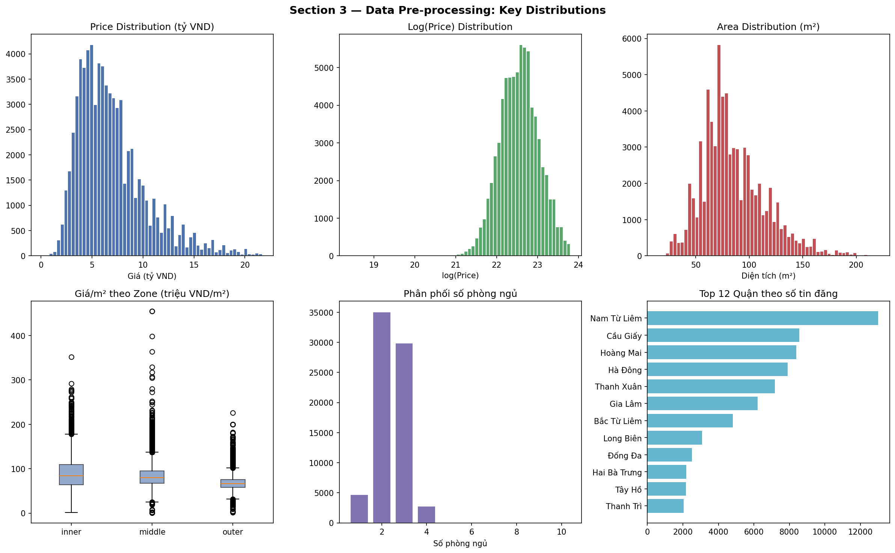
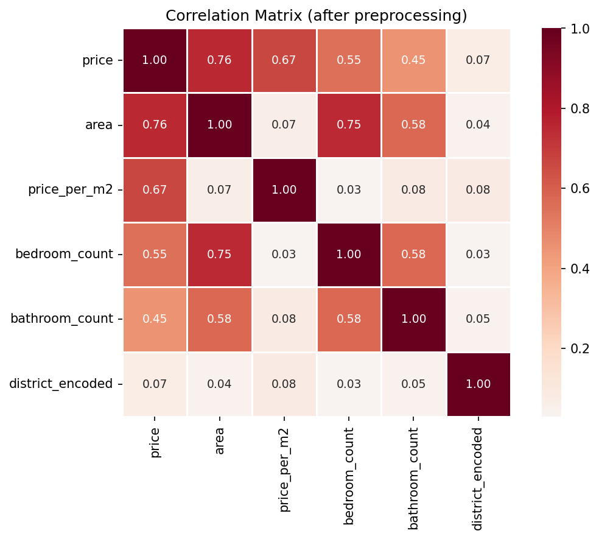
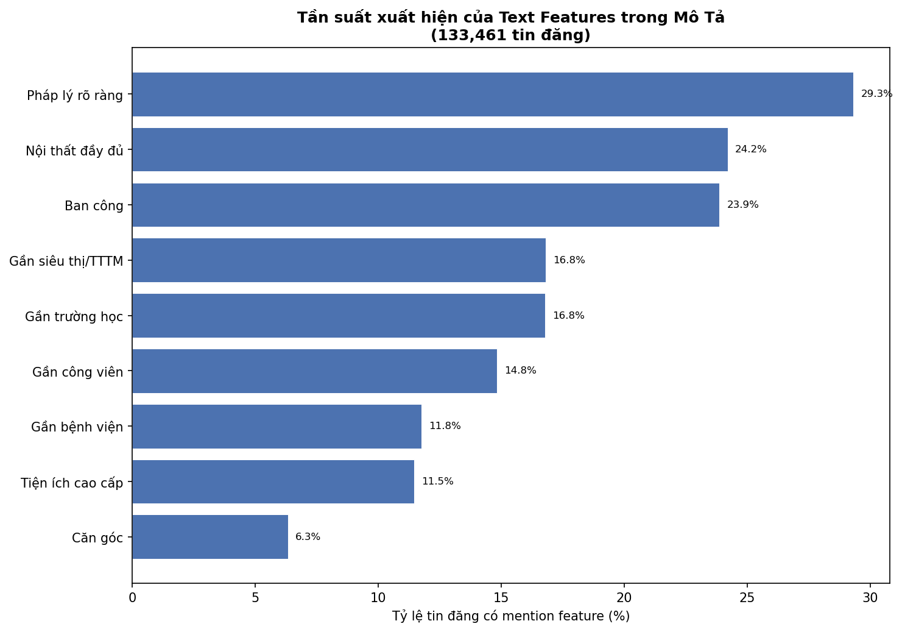
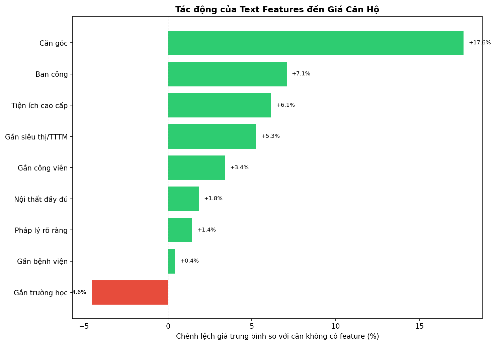
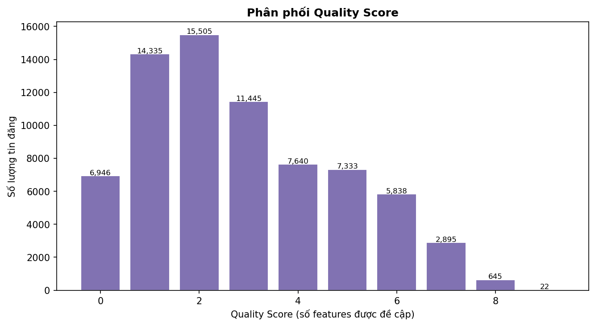

# Section 3 — Data Pre-processing and Transformation (10%)

> **Script:** `section_3_preprocessing.py` *(1 file duy nhất, pipeline đầy đủ)*
> **Input:** `data/hanoi_apartments_cleaned.csv` — 86.601 bản ghi × 19 cột
> **Output:**
> - `data/hanoi_apartments_processed.csv` — **72.604 bản ghi × 51 cột** (dùng cho EDA và LightGBM)
> - `data/hanoi_apartments_for_clustering.csv` — 72.604 bản ghi × 8 cột scaled (dùng cho K-Means)
> - `plots/section_3/section3_distributions.png`
> - `plots/section_3/section3_correlation.png`
> - `plots/section_3/section3b_feature_price_impact.png`
> - `plots/section_3/section3b_feature_frequency.png`
> - `plots/section_3/section3b_quality_score.png`

---

## Tổng quan pipeline tiền xử lý (13 bước)

| Bước | Thao tác | Kết quả |
|---|---|---|
| 0 | Load raw data | 86.601 × 19 |
| 1 | Phân tích missing values | Xác định cột/biến cần xử lý |
| 2 | Loại cột missing >= 95% | Xóa 4 cột (`floor_count`, `frontage_width`, `house_depth`, `road_width`) |
| 3 | Loại cột không có giá trị phân tích | Xóa 4 cột (`name`, `description`, `province_name`, `property_type_name`); lưu tạm `description` để dùng ở Bước 10 |
| 4 | Xử lý missing values | Xóa 12.157 dòng thiếu giá; fill median/Unknown |
| 5 | Phát hiện và loại outliers | Xóa thêm 1.840 dòng (2,5%) |
| 6 | Feature Engineering | Thêm `price_per_m2`, `pub_month`, `pub_year`, `district_zone` |
| 7 | Log Transform | Giảm skewness: price 1,25→-0,16; area 0,88→-0,22 |
| 8 | Encoding categorical | Label encode district; One-hot encode house_direction (13 cột) |
| 9 | Chuẩn hóa (StandardScaler) | Ma trận 6 features scaled cho K-Means |
| 10 | **Text Feature Extraction** | 17 binary features + `quality_score` từ `description` |
| 11 | Final summary | 72.604 × 51, không còn null |
| 12 | Lưu output | 2 CSV files |
| 13 | Vẽ biểu đồ | 5 plots |

---

## Bước 1 — Phân tích Missing Values

**Kết quả:**

| Cột | Missing | % |
|---|---|---|
| `house_depth` | 86.544 | 99,93% |
| `road_width` | 86.536 | 99,92% |
| `floor_count` | 86.465 | 99,84% |
| `frontage_width` | 86.420 | 99,79% |
| `balcony_direction` | 42.435 | 49,00% |
| `house_direction` | 42.320 | 48,87% |
| `street_name` | 35.511 | 41,01% |
| `ward_name` | 15.913 | 18,38% |
| `price` | 12.157 | 14,04% |
| `project_name` | 11.991 | 13,85% |
| `bathroom_count` | 8.892 | 10,27% |
| `bedroom_count` | 5.877 | 6,79% |

**Nhận xét:**
Dữ liệu có hai nhóm missing rõ ràng: nhóm gần 100% (các đặc trưng vật lý chi tiết của nhà như `house_depth`, `road_width`, `floor_count`, `frontage_width`) và nhóm ~49% (hướng nhà, hướng ban công). Nhóm gần 100% cho thấy các trường này không được thu thập đối với căn hộ chung cư trên BatDongSan.com.vn — đây là thông tin phù hợp với thực tế vì căn hộ chung cư thường không có "đường vào" hay "chiều sâu nhà" theo nghĩa truyền thống.

---

## Bước 2 — Loại cột có >= 95% Missing

**Kết quả:** Xóa 4 cột: `floor_count`, `frontage_width`, `house_depth`, `road_width`
**Shape:** 86.601 × 19 → 86.601 × 15

**Nhận xét:**
Các cột này có tỷ lệ missing quá cao (>99%), việc giữ lại hoặc điền giá trị sẽ tạo ra dữ liệu giả. Loại bỏ hoàn toàn là lựa chọn phù hợp để tránh bias trong mô hình.

---

## Bước 3 — Loại cột không có giá trị phân tích dạng cấu trúc

**Kết quả:** Xóa 4 cột: `name`, `description`, `province_name`, `property_type_name`
**Shape:** 86.601 × 15 → 86.601 × 11

**Nhận xét:**
- `description`: **không bị bỏ qua** — trước khi xóa, toàn bộ 86.348 descriptions được lưu tạm và xử lý riêng tại **Bước 10 (Text Feature Extraction)**, tạo ra 17 binary features + `quality_score`.
- `name`: tiêu đề tin đăng, không bổ sung thêm thông tin cấu trúc so với `description`.
- `province_name`: toàn bộ 86.601 bản ghi = "Hà Nội" → phương sai = 0, không mang thông tin phân biệt.
- `property_type_name`: toàn bộ = "Căn hộ chung cư" → tương tự, phương sai = 0.

---

## Bước 4 — Xử lý Missing Values

**Kết quả chi tiết:**

| Cột | Chiến lược | Số dòng xử lý |
|---|---|---|
| `price` | **Xóa dòng** (biến mục tiêu, không thể điền) | 12.157 dòng removed |
| `bedroom_count` | Fill median theo quận (fallback: 2.0) | 5.877 dòng filled |
| `bathroom_count` | Fill median theo quận (fallback: 2.0) | 8.892 dòng filled |
| `ward_name` | Fill "Unknown" | 14.213 dòng filled |
| `street_name` | Fill "Unknown" | 30.709 dòng filled |
| `project_name` | Fill "Unknown" | 11.121 dòng filled |
| `house_direction` | Fill "Unknown" | 36.188 dòng filled |
| `balcony_direction` | Fill "Unknown" | 36.279 dòng filled |

**Shape sau bước 4:** 74.444 × 11 (không còn null nào)

**Nhận xét:**
- Việc xóa 12.157 dòng thiếu `price` là bắt buộc — price là biến mục tiêu và không thể được suy ra từ các thuộc tính khác một cách tin cậy.
- Dùng **median theo quận** (không phải median tổng thể) cho `bedroom_count` và `bathroom_count` giúp giữ được tính đặc trưng theo vùng. Ví dụ, căn hộ ở Hoàn Kiếm có thể có số phòng ngủ trung vị khác Gia Lâm.
- Các cột text/categorical dùng "Unknown" thay vì xóa dòng, để bảo toàn 30.709 bản ghi có giá trị `price` và `area` hợp lệ.

---

## Bước 5 — Phát hiện và Loại Outliers

**Phương pháp:** IQR × 3.0 kết hợp với ngưỡng domain knowledge

**Kết quả:**

| Feature | Bounds | Outliers removed | % |
|---|---|---|---|
| `price` | [100 triệu, 21,7 tỷ] VND | 1.656 | 2,2% |
| `area` | [15, 221] m² | 905 | 1,2% |
| `bedroom_count` | [1, 10] phòng | 2 | 0,0% |
| **Tổng** | — | **1.840** | **2,5%** |

**Shape sau bước 5:** 72.604 × 11

**Nhận xét:**
- **Price:** Giới hạn trên 21,7 tỷ VND từ IQR×3 khớp tốt với thực tế thị trường căn hộ chung cư Hà Nội. Giới hạn dưới 100 triệu VND được đặt theo domain knowledge (không có căn hộ hợp lệ dưới 100 triệu).
- **Area:** Giới hạn [15, 221] m² loại bỏ những bản ghi có diện tích bất thường (3,9 m² hoặc 77.763 m² rõ ràng là lỗi nhập liệu). Căn hộ chung cư Hà Nội thực tế nằm trong khoảng 30–200 m² là chủ yếu.
- Tỷ lệ 2,5% bị loại bỏ là hợp lý — không quá nhiều để mất thông tin, nhưng đủ để làm sạch dữ liệu bất hợp lý.

---

## Bước 6 — Feature Engineering

**Các feature mới được tạo:**

| Feature mới | Công thức / Logic | Ý nghĩa |
|---|---|---|
| `price_per_m2` | price / area | Chỉ số giá tham chiếu theo m² |
| `pub_month` | tháng từ `published_at` | Yếu tố thời vụ |
| `pub_year` | năm từ `published_at` | Xu hướng theo năm |
| `district_zone` | Phân nhóm quận theo vị trí | inner / middle / outer |

**Phân bố `district_zone`:**

| Zone | Số tin | Quận đại diện |
|---|---|---|
| `inner` (nội thành lõi) | 6.131 (8,5%) | Hoàn Kiếm, Ba Đình, Đống Đa, Hai Bà Trưng |
| `middle` (vành đai 2-3) | 55.111 (75,9%) | Cầu Giấy, Thanh Xuân, Hoàng Mai, Hà Đông... |
| `outer` (ngoại thành) | 11.362 (15,6%) | Gia Lâm, Đông Anh, Sóc Sơn... |

**Thống kê `price_per_m2`:**
- Min: 0,8 triệu VND/m²
- Max: 454,5 triệu VND/m²
- **Mean: 81,1 triệu VND/m²**
- **Median: 77,6 triệu VND/m²**

**Nhận xét:**
- `price_per_m2` là chỉ số quan trọng để so sánh giá giữa các căn hộ có diện tích khác nhau — đặc biệt hữu ích cho K-Means clustering.
- `district_zone` tạo ra biến phân nhóm có ý nghĩa kinh doanh: thị trường căn hộ Hà Nội tập trung chủ yếu ở vành đai trung (75,9%), phản ánh xu hướng đô thị hóa ra ngoài lõi trung tâm.
- Chỉ 8,5% tin đăng thuộc nội thành lõi — phù hợp với thực tế quỹ đất nội thành hạn chế.

---

## Bước 7 — Log Transform

**Kết quả:**

| Feature | Skewness trước | Skewness sau log | Cải thiện |
|---|---|---|---|
| `price` | 1,25 | -0,16 | Giảm mạnh |
| `area` | 0,88 | -0,22 | Giảm rõ rệt |
| `price_per_m2` | 1,36 | -0,67 | Giảm đáng kể |

**Nhận xét:**
- Cả 3 biến số quan trọng đều có phân phối lệch phải (right-skewed) trước khi transform — điển hình với dữ liệu kinh tế.
- Sau log transform, skewness giảm về gần 0 (phân phối chuẩn hơn), giúp:
  - K-Means hoạt động tốt hơn (thuật toán nhạy với phân phối và scale).
  - Regression giảm ảnh hưởng của các giá trị cực đoan.
- Dùng `log1p` (log(x+1)) để tránh lỗi với giá trị bằng 0.

---

## Bước 8 — Encoding Categorical Variables

**Kết quả:**

| Cột | Phương pháp | Kết quả |
|---|---|---|
| `district_name` | Label Encoding | `district_encoded` — 24 classes |
| `district_zone` | Label Encoding | `zone_encoded` — 3 classes (inner=0, middle=1, outer=2) |
| `house_direction` | One-Hot Encoding | 13 cột `dir_*` |

**Nhận xét:**
- **Label Encoding** cho `district_name`: phù hợp với LightGBM (tree-based model không bị ảnh hưởng bởi thứ tự label). Với K-Means, dùng cẩn thận vì label encode tạo ra thứ tự giả tạo.
- **One-Hot Encoding** cho `house_direction`: phù hợp với K-Means (khoảng cách Euclidean) và tránh bias thứ tự. 13 cột bao gồm 12 hướng + "Unknown".

---

## Bước 9 — Chuẩn hóa (StandardScaler cho K-Means)

**Features được scale:**
`log_price`, `log_area`, `bedroom_count`, `bathroom_count`, `log_price_per_m2`, `district_encoded`

**Nhận xét:**
K-Means dựa trên khoảng cách Euclidean — nếu không chuẩn hóa, biến có scale lớn (như `price`) sẽ chiếm ưu thế và làm sai lệch kết quả clustering. StandardScaler đưa mỗi feature về mean=0, std=1, đảm bảo mỗi biến đóng góp đồng đều vào phép tính khoảng cách.

---

## Bước 10 — Text Feature Extraction từ cột `description`

Cột `description` chứa thông tin giá trị không có trong các trường cấu trúc: nội thất, pháp lý, tiện ích dự án, vị trí xung quanh. Thay vì bỏ qua, bộ 17 keyword pattern được dùng để tạo binary indicator features.

### 17 Text Features được trích xuất

| Cột | Keyword mẫu | Tần suất |
|---|---|---|
| `feat_full_furniture` | nội thất đầy đủ, full đồ, xách vali vào | 44,5% |
| `feat_balcony` | ban công | 43,9% |
| `feat_red_book` | sổ đỏ, sổ hồng | 38,7% |
| `feat_near_school` | trường học, trường mầm non, trường quốc tế | 30,9% |
| `feat_near_mall` | siêu thị, trung tâm thương mại, vinmart, lotte | 30,9% |
| `feat_nice_view` | view, tầm nhìn, toàn cảnh | 28,8% |
| `feat_near_park` | công viên | 27,3% |
| `feat_near_hospital` | bệnh viện | 21,7% |
| `feat_legal_full` | pháp lý đầy đủ, pháp lý rõ ràng | 20,4% |
| `feat_swimming_pool` | bể bơi, hồ bơi | 16,5% |
| `feat_natural_light` | ánh sáng tự nhiên, thoáng sáng | 15,5% |
| `feat_gym` | gym, phòng tập, fitness | 12,8% |
| `feat_corner_unit` | căn góc | 11,6% |
| `feat_playground` | sân chơi, khu vui chơi | 10,4% |
| `feat_security` | bảo vệ 24/7, an ninh 24 | 5,1% |
| `feat_parking` | bãi đỗ xe, hầm xe, slot ô tô | 5,4% |
| `feat_elevator` | thang máy | 4,7% |
| `quality_score` | Tổng số features = 1 (0–14) | mean=3,69 |

### Tác động của Text Features đến Giá

| Feature | Giá trung bình CÓ | Giá trung bình KHÔNG | Chênh lệch |
|---|---|---|---|
| Bãi đỗ xe/hầm xe | 8,48 tỷ | 6,87 tỷ | **+23,4%** |
| Căn góc | 8,02 tỷ | 6,82 tỷ | **+17,6%** |
| Gym/phòng tập | 7,66 tỷ | 6,85 tỷ | **+11,7%** |
| Bể bơi | 7,57 tỷ | 6,83 tỷ | **+10,8%** |
| View đẹp | 7,43 tỷ | 6,76 tỷ | **+9,9%** |
| Thang máy | 7,57 tỷ | 6,93 tỷ | **+9,2%** |
| Bảo vệ 24/7 | 7,56 tỷ | 6,92 tỷ | **+9,2%** |
| Ban công | 7,22 tỷ | 6,75 tỷ | **+7,1%** |
| Gần siêu thị/TTTM | 7,20 tỷ | 6,84 tỷ | **+5,3%** |
| Ánh sáng tự nhiên | 7,23 tỷ | 6,91 tỷ | **+4,6%** |
| Gần trường học | 6,73 tỷ | 7,06 tỷ | **-4,6%** |

### Nhận xét

- **Bãi đỗ xe/hầm xe (+23,4%)** là feature có tác động lớn nhất — phản ánh nhu cầu ô tô ngày càng cao ở Hà Nội, nhưng chỉ xuất hiện ở 5,4% tin đăng (các dự án cao cấp).
- **Căn góc (+17,6%)** là đặc điểm vật lý tác động rõ — căn góc thường có nhiều cửa sổ hơn, thoáng hơn và có giá premium đáng kể.
- **Gym + Bể bơi (~+10-11%)** cho thấy tiện ích nội khu là yếu tố định giá quan trọng của các dự án chung cư Hà Nội.
- **Gần trường học (-4,6%)** có giá thấp hơn bất ngờ — có thể do các khu dân cư gần trường thường ở ngoại thành hoặc khu vực giá thấp hơn (Gia Lâm, Hà Đông).
- **Quality_score** trung bình 3,69/17 — phần lớn tin đăng đề cập 2–5 features, ít tin nào đề cập đầy đủ tất cả tiện ích.

---

## Bước 11 Kết quả cuối cùng

### Thống kê dataset sau tiền xử lý

| Chỉ số | Giá trị |
|---|---|
| Số bản ghi | **72.604** (từ 86.601, giảm 16,2%) |
| Số cột | **51** (1 file pipeline duy nhất) |
| Không còn null | Tất cả 5 cột chính (price, area, bedroom, bathroom, district) |

### Thống kê key features

| Feature | Min | Q1 | Median | Mean | Q3 | Max |
|---|---|---|---|---|---|---|
| `price` (tỷ VND) | 0,10 | 4,50 | 6,25 | **6,96** | 8,50 | 21,70 |
| `area` (m²) | 15 | 65 | 80 | **85,1** | 101,5 | 221 |
| `price_per_m2` (triệu/m²) | 0,8 | 64,8 | 77,6 | **81,1** | 93,5 | 454,5 |
| `bedroom_count` | 1 | 2 | 2 | **2,4** | 3 | 10 |
| `bathroom_count` | 1 | 2 | 2 | **1,9** | 2 | 9 |

### Nhận xét tổng hợp

1. **Dữ liệu sau xử lý chất lượng cao:** Không còn null ở các cột phân tích chính, outliers đã được kiểm soát.

2. **Thị trường tập trung ở phân khúc trung cấp:** Median giá 6,25 tỷ VND, median diện tích 80 m², median giá/m² 77,6 triệu — phản ánh phân khúc căn hộ trung cấp chiếm ưu thế ở Hà Nội.

3. **Phân bố địa lý lệch về vành đai trung:** 75,9% tin đăng thuộc zone "middle" (Cầu Giấy, Hoàng Mai, Hà Đông...), phù hợp với xu hướng phát triển đô thị Hà Nội giai đoạn 2020–2025.

4. **Số phòng ngủ tập trung ở 2–3 phòng:** Phân phối bedroom_count cho thấy thị trường Hà Nội chuộng căn hộ 2–3 phòng ngủ (chiếm đa số), rất ít căn 1 phòng hoặc >4 phòng.

5. **Log transform hiệu quả:** Skewness của price giảm từ 1,25 xuống -0,16, sẵn sàng cho cả K-Means và LightGBM.

6. **Text features bổ sung giá trị quan trọng:** 17 binary features từ `description` cung cấp thông tin về chất lượng nội thất, pháp lý, tiện ích dự án — những thông tin không có trong các trường cấu trúc.

7. **Dữ liệu sẵn sàng cho 2 bước tiếp theo:**
   - `hanoi_apartments_processed.csv` (51 cột) → Section 4 (EDA) + Section 5 (LightGBM Regression)
   - `hanoi_apartments_for_clustering.csv` → Section 5 (K-Means Clustering)

### Thống kê features của hanoi_apartments_processed.csv và hanoi_apartments_for_clustering.csv

#### A. `hanoi_apartments_processed.csv` — 72.604 bản ghi × 51 cột
*(Dùng cho EDA — Section 4 và LightGBM Regression — Section 5)*

**Nhóm 1: Địa lý & Vị trí (Categorical)**

| # | Cột | Dtype | Null | Unique | Ghi chú |
|---|---|---|---|---|---|
| 1 | `district_name` | object | 0 | 24 | Tên quận/huyện |
| 2 | `ward_name` | object | 0 | 189 | Tên phường/xã (có "Unknown") |
| 3 | `street_name` | object | 0 | 550 | Tên đường (có "Unknown") |
| 4 | `project_name` | object | 0 | 865 | Tên dự án/tòa nhà (có "Unknown") |
| 15 | `district_zone` | object | 0 | 3 | inner / middle / outer |

**Nhóm 2: Đặc trưng số gốc (Numerical)**

| # | Cột | Dtype | Min | Max | Mean |
|---|---|---|---|---|---|
| 5 | `price` | float64 | 100.000.000 | 21.700.000.000 | 6.955.900.781 |
| 6 | `area` | float64 | 15,0 | 221,0 | 85,2 |
| 7 | `bedroom_count` | float64 | 1 | 10 | 2,43 |
| 8 | `bathroom_count` | float64 | 1 | 9 | 1,90 |
| 12 | `price_per_m2` | float64 | 843.750 | 454.545.455 | 81.080.784 |
| 13 | `pub_month` | float64 | 6 | 12 | 9,14 |
| 14 | `pub_year` | float64 | 2025 | 2025 | 2025 |

**Nhóm 3: Đặc trưng số sau Log Transform**

| # | Cột | Dtype | Min | Max | Mean |
|---|---|---|---|---|---|
| 16 | `log_price` | float64 | 18,42 | 23,80 | 22,55 |
| 17 | `log_area` | float64 | 2,77 | 5,40 | 4,40 |
| 18 | `log_price_per_m2` | float64 | 13,65 | 19,93 | 18,17 |

**Nhóm 4: Encoding Categorical**

| # | Cột | Dtype | Unique | Ghi chú |
|---|---|---|---|---|
| 9 | `house_direction` | object | 13 | Hướng nhà gốc |
| 10 | `balcony_direction` | object | 13 | Hướng ban công gốc |
| 19 | `district_encoded` | int64 | 24 | Label encode của district_name (0–23) |
| 20 | `zone_encoded` | int64 | 3 | Label encode của district_zone (0–2) |
| 21–33 | `dir_*` (13 cột) | bool | 2 | One-hot encode của house_direction |

> Các cột `dir_*`: Bắc, Nam, Tây, Tây-Bắc, Tây-Nam, Tây Bắc, Tây Nam, Unknown, Đông, Đông-Bắc, Đông-Nam, Đông Bắc, Đông Nam

**Nhóm 5: Text Features từ cột `description` (Binary)**

| # | Cột | Mean (tỷ lệ = 1) | Ý nghĩa |
|---|---|---|---|
| 34 | `feat_full_furniture` | 44,5% | Nội thất đầy đủ |
| 35 | `feat_corner_unit` | 11,6% | Căn góc |
| 36 | `feat_natural_light` | 15,5% | Ánh sáng tự nhiên |
| 37 | `feat_red_book` | 38,7% | Sổ đỏ/Sổ hồng |
| 38 | `feat_legal_full` | 20,4% | Pháp lý đầy đủ |
| 39 | `feat_swimming_pool` | 16,5% | Bể bơi |
| 40 | `feat_gym` | 12,8% | Gym/Phòng tập |
| 41 | `feat_near_school` | 30,9% | Gần trường học |
| 42 | `feat_near_hospital` | 21,7% | Gần bệnh viện |
| 43 | `feat_near_mall` | 30,9% | Gần siêu thị/TTTM |
| 44 | `feat_playground` | 10,4% | Sân chơi trẻ em |
| 45 | `feat_parking` | 5,4% | Bãi đỗ xe/Hầm xe |
| 46 | `feat_elevator` | 4,7% | Thang máy |
| 47 | `feat_security` | 5,1% | Bảo vệ 24/7 |
| 48 | `feat_balcony` | 43,9% | Ban công |
| 49 | `feat_nice_view` | 28,8% | View đẹp |
| 50 | `feat_near_park` | 27,3% | Gần công viên |
| 51 | `quality_score` | mean=3,69 | Tổng số text features = 1 (range: 0–14) |

**Cột thời gian:**

| # | Cột | Dtype | Null | Ghi chú |
|---|---|---|---|---|
| 11 | `published_at` | object | 308 | Datetime gốc dạng string |

---

#### B. `hanoi_apartments_for_clustering.csv` — 72.604 bản ghi × 8 cột
*(Dùng cho K-Means Clustering — Section 5)*

| # | Cột | Dtype | Min | Max | Mean | Ghi chú |
|---|---|---|---|---|---|---|
| 1 | `scaled_log_price` | float64 | -8,646 | 2,616 | ~0 | log_price sau StandardScaler |
| 2 | `scaled_log_area` | float64 | -4,643 | 2,878 | ~0 | log_area sau StandardScaler |
| 3 | `scaled_bedroom_count` | float64 | -2,099 | 11,135 | ~0 | bedroom_count sau StandardScaler |
| 4 | `scaled_bathroom_count` | float64 | -2,033 | 15,958 | ~0 | bathroom_count sau StandardScaler |
| 5 | `scaled_log_price_per_m2` | float64 | -15,156 | 5,923 | ~0 | log_price_per_m2 sau StandardScaler |
| 6 | `scaled_district_encoded` | float64 | -1,576 | 2,169 | ~0 | district_encoded sau StandardScaler |
| 7 | `district_name` | object | — | 24 unique | — | Nhãn quận (để diễn giải cụm) |
| 8 | `district_zone` | object | — | 3 unique | — | inner / middle / outer (để diễn giải cụm) |

> **Lưu ý:** Tất cả 6 features scaled đều có mean ≈ 0 và std = 1 — xác nhận StandardScaler hoạt động đúng. Cột `district_name` và `district_zone` là nhãn phụ trợ để diễn giải kết quả clustering, **không đưa vào thuật toán K-Means**.

---

## Bước 12. Visualizations

---

### 1. `section3_distributions.png` — Phân phối các biến số chính

**Đánh giá:**

- **Price Distribution (tỷ VND):** Phân phối lệch phải rõ rệt — phần lớn tin đăng tập trung ở mức 2–10 tỷ VND, đuôi dài về phía phải cho thấy một số căn hộ cao cấp có giá lên đến 20+ tỷ. Sau khi loại outliers, phân phối đã được kiểm soát tốt hơn.

- **Log(Price) Distribution:** Sau khi áp dụng log transform, phân phối gần đối xứng và tiệm cận phân phối chuẩn (hình chuông), xác nhận log transform hiệu quả — skewness giảm từ 1,25 xuống -0,16. Dữ liệu sẵn sàng cho K-Means và LightGBM.

- **Area Distribution (m²):** Phân phối lệch phải với hai đỉnh rõ ràng ở khoảng 50–60 m² và 80–100 m² — phản ánh hai phân khúc phổ biến: căn hộ nhỏ (1–2PN) và căn hộ trung bình (2–3PN). Đuôi phải kéo dài đến ~200 m² là các căn penthouse hoặc duplex.

- **Giá/m² theo Zone (boxplot):** Nội thành (`inner`) có median và khoảng tứ phân vị cao hơn hẳn `middle` và `outer`. Đặc biệt `inner` có nhiều outliers phía trên (căn hộ cao cấp trung tâm), trong khi `outer` có phân phối thấp và ít phân tán hơn. Điều này xác nhận `district_zone` là biến phân loại có giá trị cao cho mô hình.

- **Phân phối số phòng ngủ:** Căn hộ 2 phòng ngủ chiếm đa số (~33.000 tin), tiếp theo là 3 phòng ngủ (~26.000 tin). Căn 1 phòng và ≥4 phòng chiếm tỷ lệ nhỏ — phù hợp với xu hướng thị trường căn hộ Hà Nội chuộng căn 2–3PN cho hộ gia đình.

- **Top 12 Quận:** Nam Từ Liêm dẫn đầu (~12.000+ tin), tiếp theo là Cầu Giấy, Hà Đông, Hoàng Mai. Các quận vành đai trung chiếm ưu thế, phản ánh nguồn cung căn hộ chung cư tập trung tại các khu đô thị mới phía Tây và Nam Hà Nội.

---

### 2. `section3_correlation.png` — Ma trận tương quan

**Đánh giá:**

- **`price` ~ `area` (r = 0,77):** Tương quan mạnh nhất — diện tích là yếu tố giải thích giá lớn nhất, hợp lý vì căn hộ lớn hơn thì tổng giá trị cao hơn.

- **`price` ~ `price_per_m2` (r = 0,65):** Tương quan dương trung bình — giá cao một phần do giá/m² cao (vị trí đắt), nhưng không phải hoàn toàn vì diện tích cũng ảnh hưởng lớn.

- **`price` ~ `bedroom_count` (r = 0,56):** Tương quan dương — nhiều phòng ngủ thường đi kèm diện tích lớn hơn và giá cao hơn.

- **`area` ~ `bedroom_count` (r = 0,75):** Tương quan cao — diện tích và số phòng ngủ gần như tỷ lệ thuận, cần lưu ý đa cộng tuyến khi dùng cả hai trong LightGBM.

- **`price_per_m2` ~ `area` (r = 0,03):** Gần như không tương quan — xác nhận `price_per_m2` là chỉ số độc lập, đo lường chất lượng vị trí chứ không phải kích thước căn hộ. Đây là feature có giá trị riêng biệt.

- **`district_encoded` ~ các biến khác (~0,02–0,03):** Tương quan rất thấp với các biến số — cho thấy label encoding của quận không phản ánh quan hệ tuyến tính với giá, điều này bình thường vì thứ tự label là tùy ý. Với LightGBM (tree-based), điều này không ảnh hưởng; với K-Means đã dùng `StandardScaler` để kiểm soát.

- **`bathroom_count` ~ `bedroom_count` (r = 0,58):** Tương quan dương vừa — số phòng tắm thường tăng theo số phòng ngủ, nhưng không hoàn toàn (nhiều căn 2PN chỉ có 1WC).

---

### 3. `section3b_feature_frequency.png` — Tần suất xuất hiện của 17 Text Features

**Đánh giá:**

- **Nội thất đầy đủ (44,5%) và Ban công (43,9%)** là hai features được đề cập nhiều nhất — phản ánh đây là tiêu chí cơ bản mà người bán thường nhấn mạnh, đặc biệt căn hộ đã qua sử dụng thường có nội thất sẵn và ban công là tiêu chuẩn của căn hộ chung cư.

- **Sổ đỏ/Sổ hồng (38,7%):** Hơn 1/3 tin đăng đề cập pháp lý — cho thấy đây là yếu tố quan trọng với người mua, và người bán chủ động đưa thông tin này lên để tăng tính thuyết phục.

- **Gần trường học (30,9%) và Gần siêu thị/TTTM (30,9%):** Hai tiện ích xung quanh được đề cập ngang nhau, cho thấy người bán xác định đây là hai yếu tố hút khách chính.

- **Thang máy (4,7%) và Bảo vệ 24/7 (5,1%):** Tần suất thấp không phải vì ít căn hộ có các tiện ích này, mà vì người đăng thường coi đây là tiêu chuẩn đương nhiên của chung cư, không cần đặc biệt nhấn mạnh.

- **Bãi đỗ xe/hầm xe (5,4%):** Tần suất thấp nhưng tác động giá cao nhất (xem biểu đồ tiếp theo) — đây là đặc điểm của các dự án cao cấp ít nhưng có giá trị premium rõ ràng.

---

### 4. `section3b_feature_price_impact.png` — Tác động của Text Features đến Giá

**Đánh giá:**

- **Bãi đỗ xe/hầm xe (+23,4%):** Premium cao nhất, cách biệt lớn so với các features còn lại. Các dự án có hầm xe thường là chung cư cao cấp hoặc mid-end ở vị trí đắc địa — giải thích mức tác động vượt trội.

- **Căn góc (+17,6%):** Yếu tố vật lý tác động mạnh thứ hai. Căn góc thường có nhiều cửa sổ, thông thoáng hơn, view rộng hơn — đặc điểm được thị trường định giá cao một cách nhất quán.

- **Gym/phòng tập (+11,7%) và Bể bơi (+10,8%):** Tiện ích nội khu là yếu tố định giá quan trọng, phân biệt các dự án "lifestyle" với chung cư thông thường.

- **View đẹp (+9,9%), Thang máy (+9,2%), Bảo vệ 24/7 (+9,2%):** Nhóm features cải thiện chất lượng sống và an ninh, đều có tác động tích cực tương đương nhau (~9%).

- **Ban công (+7,1%):** Mặc dù là feature phổ biến nhất (43,9%), tác động giá chỉ ở mức trung bình — vì ban công là tiêu chuẩn khá phổ biến, không còn là yếu tố phân hóa mạnh.

- **Nội thất đầy đủ (+1,8%) và Sổ đỏ/Sổ hồng (+0,5%):** Tác động giá rất thấp — không phải vì không có giá trị, mà vì hai yếu tố này quá phổ biến (38–44%) và thị trường đã phản ánh vào mức giá chung, không tạo ra premium đáng kể.

- **Gần trường học (-4,6%):** Feature duy nhất có tác động âm — các khu vực gần trường thường thuộc ngoại thành hoặc khu dân cư cũ có giá thấp hơn mặt bằng chung. Đây là hiệu ứng confounding với vị trí địa lý, không phải trường học làm giảm giá.

---

### 5. `section3b_quality_score.png` — Phân phối Quality Score

**Đánh giá:**

- **Phân phối lệch phải**, đỉnh tại score = 2 (12.893 tin) — phần lớn tin đăng chỉ đề cập 2–3 features trong mô tả, cho thấy mức độ thông tin trong tin đăng còn hạn chế.

- **4.603 tin có score = 0** (~6,3%): Không đề cập bất kỳ feature nào trong 17 tiêu chí — có thể là tin đăng ngắn gọn, mô tả chung chung, hoặc chỉ liệt kê thông số kỹ thuật mà không mô tả tiện ích.

- **Score 1–4 chiếm ~63% tổng tin đăng:** Phần lớn mô tả chỉ đề cập số lượng feature hạn chế, thường là các thông tin cơ bản như nội thất, pháp lý, hoặc một tiện ích nổi bật.

- **Score ≥ 8 chỉ chiếm ~8%:** Các tin đăng chất lượng cao với mô tả đầy đủ — thường là tin của môi giới chuyên nghiệp hoặc dự án lớn có marketing bài bản.

- **Score tối đa = 14/17:** Không có tin nào đề cập đủ 17 features — phù hợp thực tế vì một số features loại trừ nhau về đặc điểm dự án (ví dụ: căn hộ giá rẻ ngoại thành khó có cả hầm xe lẫn gym).

- **`quality_score` là feature tổng hợp hữu ích** để LightGBM học được "mức độ cao cấp" của tin đăng trong một biến số duy nhất, bổ sung cho 17 binary features riêng lẻ.
