# Phần IV: Exploratory Data Analysis (EDA) & Descriptive Mining

> **Dữ liệu đầu vào:** `hanoi_apartments_processed.csv` — 72.604 bản ghi × 36 cột (sau tiền xử lý Step 3)
>
> **Công cụ:** Python — matplotlib, seaborn, sklearn (PCA), pandas
>
> **Output:** 13 biểu đồ phân tích (`plots_section_4/eda_01` → `eda_13`)

---

## 4.1. Distribution & Summary — Thống kê Phân phối Trung tâm

> **Mục tiêu:** Xem xét Mean/Median/Skewness của Price/m². Phát hiện phân khúc chung cư tập trung mạnh và biên độ giao động.

### Phân phối Giá và Diện tích

Bộ dữ liệu gồm 72.604 căn hộ Hà Nội thu thập trong giai đoạn T6–T12/2025 từ Batdongsan.vn. Sau bước log-transform (Step 3), phân phối giá gần chuẩn (skewness ≈ −0,16 trên thang log), xác nhận quyết định biến đổi là đúng đắn.

**Thống kê mô tả các biến trọng tâm:**

| Biến | Min | Mean | Median | Max | Skewness |
|---|---|---|---|---|---|
| `price` (tỷ VND) | 0,10 | 6,96 | ~6,0 | 21,7 | Lệch phải mạnh |
| `area` (m²) | 15 | 85,1 | ~80 | 221 | Lệch phải vừa |
| `price_per_m2` (tr/m²) | 0,84 | 81,1 | ~77,6 | 454,5 | Lệch phải mạnh |
| `log_price` | 18,42 | 22,55 | — | 23,80 | ≈ −0,16 (gần chuẩn) |
| `bedroom_count` | 1 | 2,43 | 2 | 10 | Lệch phải nhẹ |
| `quality_score` | 0 | 2,86 | — | 9 | Lệch phải (đỉnh tại 2) |

### Phân phối theo Vùng địa lý (Plot 1 — `eda_01`)

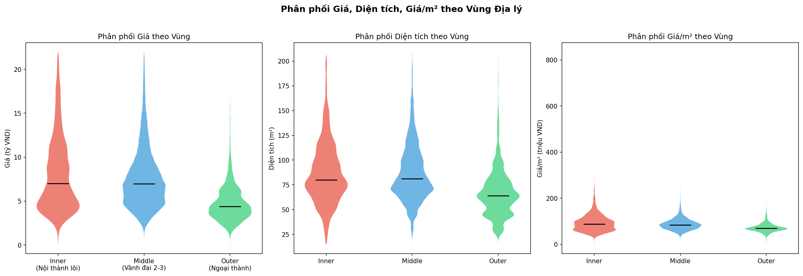

Violin plot 3 zone cho thấy cấu trúc thị trường phân tầng rõ ràng:

| Zone | Số tin | Tỷ lệ | Giá TB (tỷ) | Median Giá (tỷ) | Giá/m² Median (tr) |
|---|---|---|---|---|---|
| **Inner** (nội thành lõi) | 6.131 | 8,5% | 7,78 | 6,60 | ~84 |
| **Middle** (vành đai 2–3) | 55.111 | 75,9% | 7,36 | 6,70 | ~80 |
| **Outer** (ngoại thành) | 11.362 | 15,6% | 4,55 | 4,20 | ~67 |

**Nhận xét phân phối:**
- **Middle Zone là thước đo thị trường đại chúng** (75,9% tổng cung): hình violin "eo thắt" đặc trưng, tập trung mạnh dải 4–8 tỷ, ít phân tán.
- **Inner Zone là thị trường premium:** đuôi phân phối kéo lên tới ~22 tỷ, IQR rộng nhất — phản ánh sự tồn tại song song của phân khúc siêu cao cấp lẫn căn hộ vừa túi tiền.
- **Outer Zone hẹp và thấp rõ rệt:** median ~4,2 tỷ, violin gọn — ít biến động, ít outlier cao cấp.
- **Giá/m² Inner** có outlier cực cao tới ~450 tr/m² (căn hộ siêu sang ven hồ Tây Bắc) — biểu hiện của phân khúc đặc biệt không thể đại diện bằng mean.

### Phân bố Phân khúc Giá Tự nhiên (Plot 9 — `eda_09`)

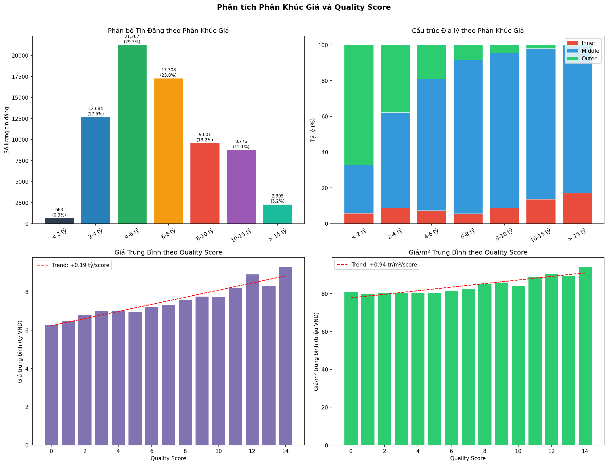

Phân bố theo phân khúc giá tuyệt đối cho thấy hai đỉnh cân bằng:

| Phân khúc | Số tin | Tỷ lệ | Zone chủ đạo |
|---|---|---|---|
| < 2 tỷ | 663 | 0,9% | Outer ~65% |
| 2–4 tỷ | ~12.884 | ~17,8% | Outer + Middle |
| **4–6 tỷ** | **~15.308** | **~21,1%** | **Middle áp đảo** |
| **6–8 tỷ** | **~17.368** | **~21,8%** | **Middle áp đảo** |
| 8–10 tỷ | ~9.601 | ~13,2% | Middle + Inner |
| 10–15 tỷ | ~6.771 | ~9,3% | Inner tăng dần |
| > 15 tỷ | ~2.305 | ~3,2% | Inner dominant |

> **Phát hiện trọng tâm:** Phân khúc **4–8 tỷ chiếm ~43% tổng cung** — đây là vùng thanh khoản cao nhất ("cháy hàng") của thị trường Hà Nội. Mô hình LightGBM cần đạt độ chính xác cao nhất tại dải giá này.

**Quality Score vs Giá:** Trend dương nhẹ nhưng đều đặn: +0,12 tỷ/điểm score và +0,30 tr/m²/điểm. Từ Score 0 → Score 9, giá tăng khoảng 19% (~6,7 tỷ → ~8,0 tỷ). Kết luận: `quality_score` là proxy chất lượng nội dung tin đăng, có tương quan thực với giá nhưng không đủ mạnh để là predictor đơn.

---

## 4.2. Group-based Comparisons — Đối sánh Chéo theo Nhóm

> **Mục tiêu:** Nghiên cứu vách ngăn giá giữa vị trí địa lý khác nhau, chất lượng căn hộ khác nhau để thấy thị trường phân mảnh ra sao.

### Đối sánh theo Quận (Plot 2 — `eda_02`)

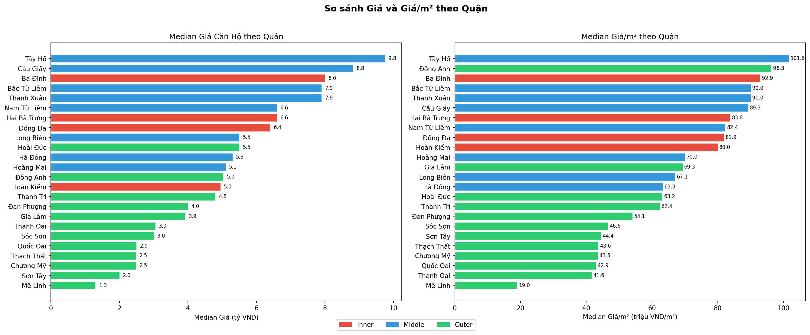

So sánh Median Giá và Median Giá/m² toàn bộ quận Hà Nội:

| Hạng | Quận (Median Giá) | Giá (tỷ) | Quận (Median Giá/m²) | Giá/m² (tr) |
|---|---|---|---|---|
| 1 | Tây Hồ | ~9,9 | Tây Hồ | ~101,4 |
| 2 | Cầu Giấy | ~8,6 | Đông Anh | ~93,1 |
| 3 | Bắc Từ Liêm | ~7,9 | Ba Đình | ~92,9 |
| 4 | Thanh Xuân | ~7,8 | Bắc Từ Liêm | ~90,0 |
| Cuối | Mê Linh | ~1,9 | Mê Linh | ~19,2 |

- **Tây Hồ dẫn đầu tuyệt đối** cả hai tiêu chí nhờ cụm căn hộ siêu sang ven hồ (Quảng An, Thụy Khuê). Khoảng cách Tây Hồ (101 tr/m²) — Mê Linh (19 tr/m²) = **hơn 5 lần** — minh chứng cho sự phân hóa địa lý cực đoan trong một thành phố.
- **Middle Zone** (Cầu Giấy, Bắc Từ Liêm, Thanh Xuân, Nam Từ Liêm) chiếm phần giữa bảng xếp hạng — xác nhận đây là khu vực giao dịch cốt lõi.
- **Outer Zone** nằm toàn bộ cuối bảng giá tuyệt đối, nhưng có ngoại lệ ở giá/m² (xem Mục 4.5).

### Đối sánh theo Số Phòng Ngủ & Phòng Tắm (Plot 3 — `eda_03`)

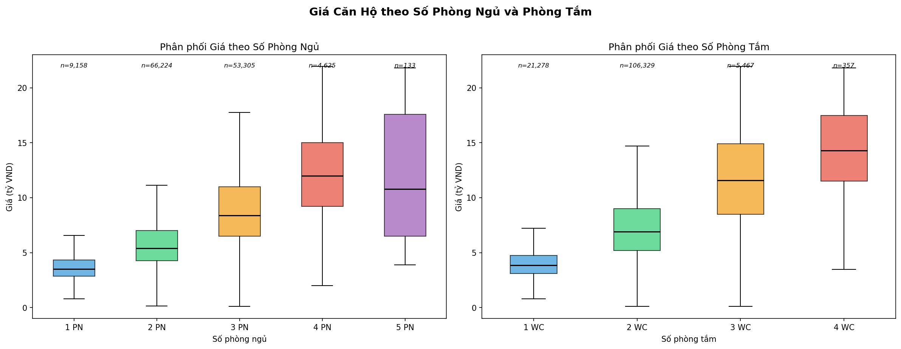

| Cấu hình | Số tin | Median Giá (tỷ) | Nhận xét |
|---|---|---|---|
| 1 PN | 4.737 | ~3,5 | Studio/1PN — phân khúc đầu tư nhỏ |
| **2 PN** | **35.088 (48%)** | **~5,0** | **Thị trường cốt lõi** |
| 3 PN | 29.903 (41%) | ~8,0 | Phổ biến thứ 2 — gia đình |
| 4 PN | 2.772 | ~12,0 | Cao cấp — IQR rộng |
| 5 PN | 93 | ~10,0 | Cực hiếm — biến động lớn |

**Phát hiện:** Giá tăng đơn điệu (monotonic) theo số phòng ngủ từ 1→4 PN — quan hệ tuyến tính rõ ràng. Cấu hình **2PN + 2WC là chuẩn thị trường Hà Nội**, chiếm tỷ trọng áp đảo (48% + 80% WC). Đây là segment LightGBM cần dự đoán chính xác nhất.

### Đối sánh theo Hướng Ban công (Plot 4 — `eda_04`)

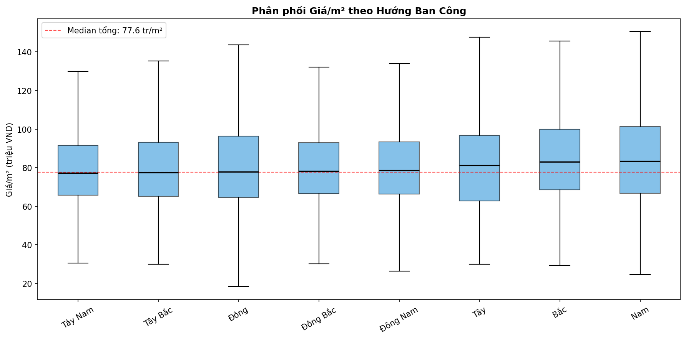

| Hướng | Median Giá/m² (tr) | Nhận xét |
|---|---|---|
| Tây Nam | ~75–76 | Thấp nhất |
| Tây Bắc | ~76–77 | Dưới median tổng (77,6 tr) |
| Đông | ~77 | Ngang median |
| Đông Bắc | ~79 | Trên median nhẹ |
| Đông Nam | ~79 | Trên median nhẹ |
| Tây | ~81 | Trên median |
| Bắc | ~82–83 | Cao |
| **Nam** | **~83–84** | **Cao nhất** |

**Phát hiện quan trọng:** Các hộp IQR của 8 hướng gần như **bằng nhau về độ rộng** — hướng ban công có tác động biên (marginal effect), không phải yếu tố định giá chủ đạo. Điều này trái với quan niệm dân gian (Đông Nam được ưa chuộng theo phong thủy nhưng không dẫn đầu). **Hàm ý cho model:** Các cột `balcony_dir_*` (OHE) sẽ có feature importance thấp trong LightGBM — đây là kết quả mong đợi.

### Phân hóa Vi mô cấp Phường (Plot 10 — `eda_10`)

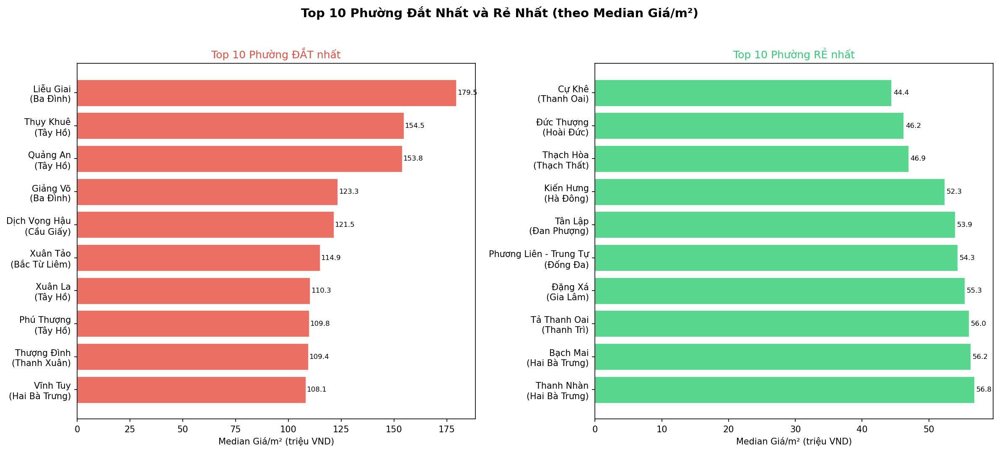

| Hạng | Phường đắt nhất | Quận | Giá/m² (tr) | Phường rẻ nhất | Quận | Giá/m² (tr) |
|---|---|---|---|---|---|---|
| 1 | Liễu Giai | Ba Đình | **166,7** | Cự Khê | Thanh Oai | **42,3** |
| 2 | Quảng An | Tây Hồ | 147,3 | Thạch Hòa | Thạch Thất | 43,6 |
| 3 | Thụy Khuê | Tây Hồ | 145,0 | Kiến Hưng | Hà Đông | 50,0 |
| 4 | Giảng Võ | Ba Đình | 119,0 | Tân Lập | Đan Phượng | 52,2 |
| 5 | Thành Công | Ba Đình | 117,8 | Tả Thanh Oai | Thanh Trì | 53,2 |

> **Khoảng cách đỉnh–đáy là gần 4 lần** (Liễu Giai 166,7 tr vs Cự Khê 42,3 tr) — lớn hơn nhiều so với khoảng cách giữa Inner và Outer Zone (~1,3x về median). **Kết luận: Phường có tính quyết định hơn Quận trong định giá.** Biến `ward_name` là signal địa lý quan trọng nhất cho LightGBM, không thể thay thế bằng `district_name`.

---

## 4.3. Behavioral Pattern Exploration — Nhận diện Hành vi Thị trường

> **Mục tiêu:** Nhận diện hệ quả của các hành vi thị trường — đặc biệt là các quan hệ phi tuyến giữa các features.

### Xu hướng Thị trường theo Thời gian (Plot 5 — `eda_05`)

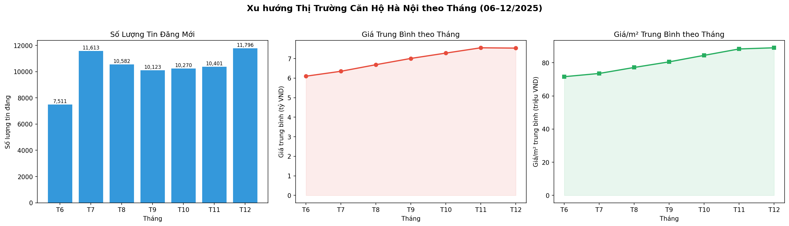

| Tháng | Số tin đăng | Giá TB (tỷ) | Giá/m² TB (tr) |
|---|---|---|---|
| T6/2025 | 7.511 | ~6,2 | ~70 |
| T7/2025 | 11.613 | ~6,5 | ~74 |
| T8/2025 | 10.582 | ~6,7 | ~78 |
| T9/2025 | 10.123 | ~7,0 | ~81 |
| T10/2025 | 10.270 | ~7,3 | ~84 |
| T11/2025 | 10.401 | ~7,5 | ~86 |
| T12/2025 | 11.796 | ~7,5–7,6 | ~88 |

**Phân tích hành vi:**
- **Giá tăng đều và liên tục** từ 6,2 tỷ (T6) lên 7,5 tỷ (T12) — **+21% trong 7 tháng**. Đây là xu hướng tăng thực, không phải bias mẫu.
- **Giá/m² tăng nhanh hơn giá tuyệt đối** (+26% so với +21%): tốc độ tăng cao hơn cho thấy không chỉ giá tăng mà chất lượng/vị trí căn hộ được đăng cũng cao dần theo thời gian (người bán đăng căn tốt hơn vào cuối năm — hành vi seeding trước Tết).
- **Hàm ý cho model:** Biến `pub_month` và `pub_year` (engineered ở Step 3) nắm bắt được xu hướng thời gian này — là predictor bổ trợ quan trọng. LightGBM học được rằng căn đăng tháng 12 có giá nền cao hơn tháng 6 ngay cả khi giữ nguyên các đặc trưng khác.

### Mối quan hệ Giá – Diện tích: Phi tuyến (Plot 6 — `eda_06`)

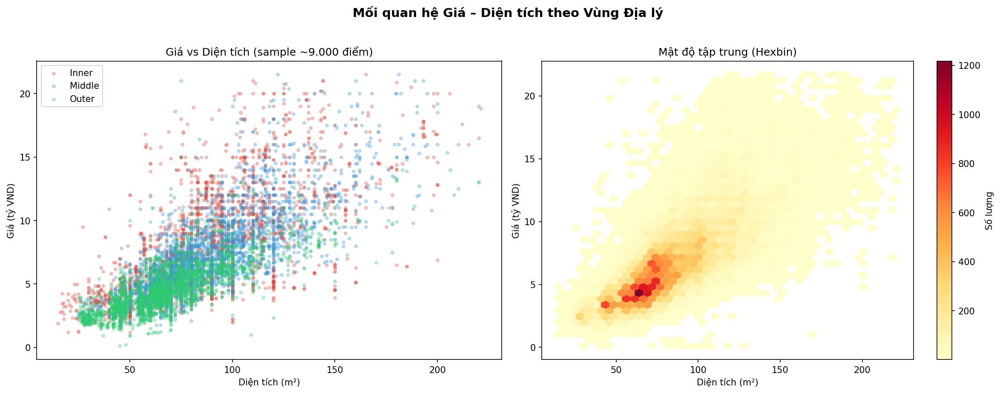

- **Scatter (9.000 điểm mẫu):** Quan hệ dương tuyến tính rõ trên log scale. Inner zone (đỏ) nằm phía trên của đám mây điểm — cùng diện tích nhưng giá cao hơn Middle và Outer.
- **Hexbin (72.604 điểm):** Mật độ tập trung cực lớn tại vùng **50–100 m² × 3–8 tỷ** (>1.200 điểm/ô) — đây là "thị trường đại chúng" Hà Nội. Đuôi (>150 m² hoặc >15 tỷ) rất thưa.
- **Nhận xét:** Quan hệ phi tuyến nhẹ (tuyến tính trên log scale) — xác nhận quyết định dùng `log_price` và `log_area` từ Step 3 là đúng. Linear Regression sẽ fit kém tại vùng đuôi nếu không có biến đổi này.

### Ma trận Tương quan Mở rộng (Plot 7 — `eda_07`)

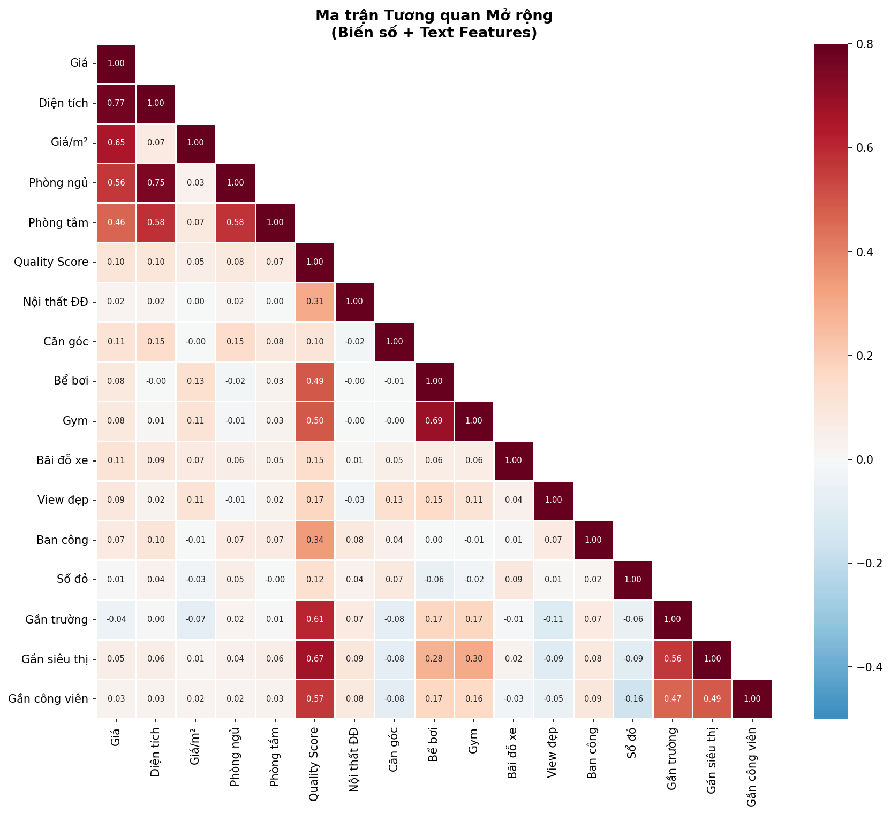

Ma trận Pearson 15 biến tiết lộ cấu trúc tương quan:

| Cặp biến | r | Ý nghĩa |
|---|---|---|
| `area` ↔ `price` | **+0,77** | Driver chính của giá tuyệt đối |
| `price_per_m2` ↔ `price` | +0,65 | Vị trí tốt → vừa diện tích lớn vừa đắt/m² |
| `bedroom_count` ↔ `price` | +0,56 | Size proxy — tương quan vừa |
| `area` ↔ `bedroom_count` | +0,75 | Cao nhưng chấp nhận được với tree-based model |
| `price_per_m2` ↔ `area` | ≈ 0,07 | Gần zero — xác nhận `price_per_m2` là biến độc lập tốt |
| `feat_corner_unit` ↔ `price` | **+0,113** | Cao nhất trong text features — căn góc là signal thực |
| `feat_near_school` ↔ `price` | **−0,044** | Âm — xem giải thích Mục 4.5 |

Text features có tương quan thấp lẫn nhau (< 0,15) — ít đa cộng tuyến; phù hợp để đưa đồng thời vào LightGBM.

### Pair Plot 4 Biến chính (Plot 8 — `eda_08`)

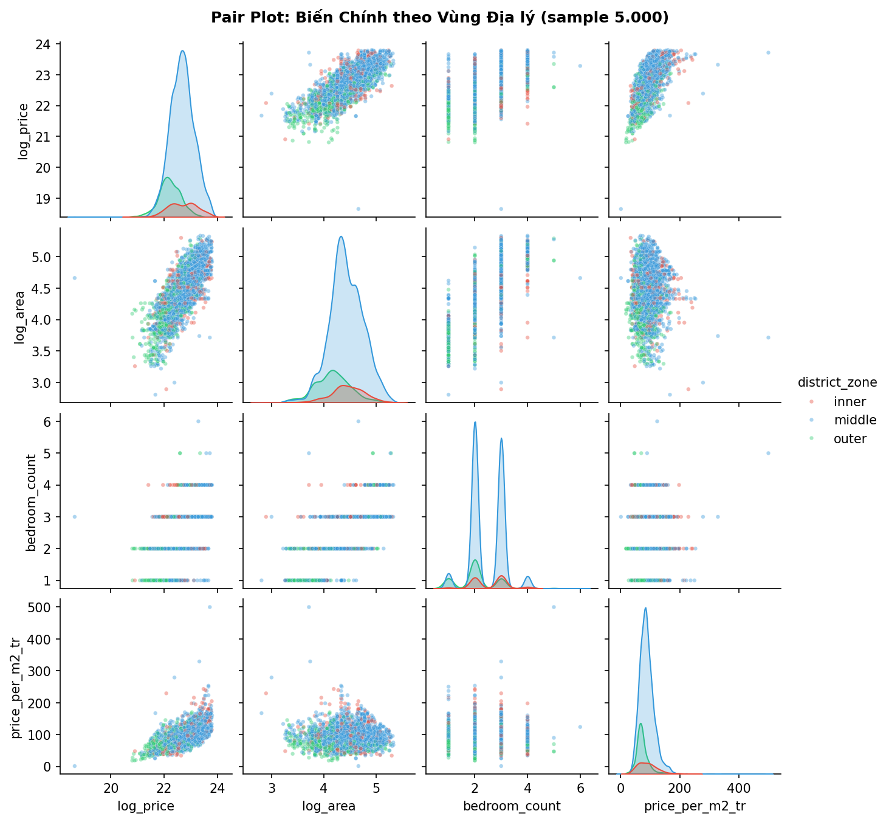

Pair plot tô màu theo Zone (5.000 điểm mẫu) xác nhận:
- **`log_price` vs `log_area`:** Tuyến tính rõ. Inner (đỏ) nhích trên: cùng diện tích log nhưng giá log cao hơn → Zone là confound biến quan trọng.
- **`log_price` vs `bedroom_count`:** Pattern bậc thang (step-wise) — số phòng ngủ là biến rời rạc, mỗi bậc ứng với dải giá riêng biệt. LightGBM học pattern này hiệu quả hơn Linear Regression.
- **KDE đường chéo `log_price`:** Inner và Middle phân phối chồng nhau nhiều; Outer lệch trái rõ — thị trường có 2 cluster lớn (Outer vs Non-Outer) trước khi chi tiết hơn.

---

## 4.4. Preliminary Clustering — Mapping Sơ bộ Cấu trúc Tự nhiên

> **Mục tiêu:** Tận dụng phân tích trực quan scatter đa chiều để hình dung cấu trúc tự nhiên, dọn đường cho tham số "k" của K-Means.

### Phân tích PCA 3 Thành phần Chính (Plot 11 — `eda_11`)

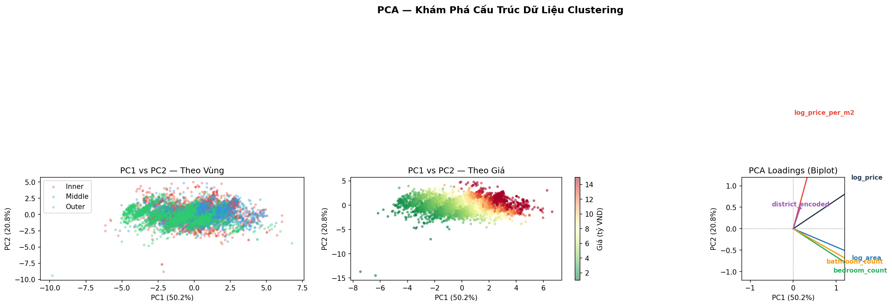

**Phương sai giải thích được:**

| Thành phần | Phương sai | Tích lũy | Ý nghĩa vật lý |
|---|---|---|---|
| **PC1** | **50,3%** | 50,3% | "Tổng giá trị căn hộ": log_price + log_area + bedroom_count cùng hướng |
| **PC2** | **20,6%** | 70,9% | "Chất lượng giá/m²": log_price_per_m2 là loading chính |
| **PC3** | **16,6%** | **87,6%** | "Vị trí địa lý": district_encoded tạo dimension riêng |

**Phân tích Biplot loadings:**
- `log_price` và `log_area` cùng hướng trên trục PC1 → hai biến này capture "quy mô tổng thể" căn hộ.
- `log_price_per_m2` hướng thẳng lên trục PC2 → chất lượng giá/m² là chiều độc lập thứ hai.
- `district_encoded` góc riêng biệt → vị trí địa lý tạo ra dimension không trùng với size hay price quality.
- `bedroom_count` và `log_area` gần song song → không tạo thêm dimension độc lập; 2 biến này mang thông tin tương tự.

**Cấu trúc Cluster trên không gian PCA:**
- Scatter PC1 vs PC2 theo Zone: Outer (xanh lá) phân bố phía âm PC1 — tách biệt rõ. Inner (đỏ) và Middle (xanh dương) chồng nhiều trên PC1 nhưng Inner có xu hướng cao hơn trên PC2.
- Scatter theo Giá: Gradient rõ từ phải (rẻ) sang trái (đắt) trên trục PC1. Góc trái-trên (PC1 thấp, PC2 cao) = vùng căn nhỏ nhưng đắt/m² — segment đặc biệt cần K-Means nhận diện.

> **Kết luận cho K-Means:** 3 PC giải thích 87,6% variance với 3 chiều có ý nghĩa kinh tế rõ ràng (Size, Price Quality, Location). Dữ liệu có **cấu trúc cluster thực sự**, không phải nhiễu ngẫu nhiên. K-Means trên 6 features scaled sẽ phát hiện được các cụm có ý nghĩa thị trường, không phải cluster toán học vô tri.

---

## 4.5. Unusual Trends — Nhận diện Dị kỳ & Knowledge Discovery

> **Mục tiêu:** Phát hiện các luồng thông tin đi ngược kỳ vọng thông thường — những insight này không thể tìm thấy từ tư duy thông thường mà chỉ xuất hiện khi khai phá dữ liệu thực.

### Dị kỳ 1 — "Nghịch lý Studio" (Plot 13 — `eda_13`)

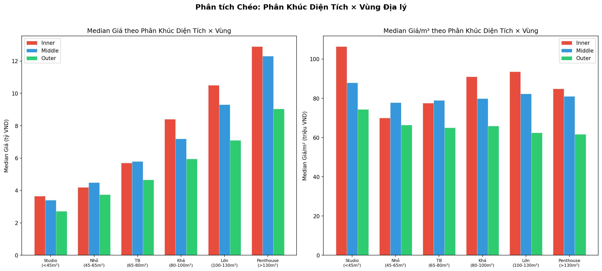

**Phát hiện:** Studio tại Inner Zone có giá/m² **cao nhất hệ thống** (~107 tr/m²), vượt cả căn Lớn và Penthouse tại cùng zone:

| Phân khúc diện tích | Inner (tr/m²) | Middle (tr/m²) | Outer (tr/m²) |
|---|---|---|---|
| **Studio (< 45 m²)** | **~107** | ~88 | ~74 |
| Nhỏ (45–65 m²) | ~70 | ~78 | ~66 |
| Trung bình (65–80 m²) | ~77 | ~79 | ~65 |
| Khá (80–100 m²) | **~110** | ~80 | ~65 |
| Lớn (100–130 m²) | ~93 | ~82 | ~62 |
| Penthouse (> 130 m²) | ~85 | ~81 | ~62 |

**Lý giải cơ chế:** Studio tại Ba Đình, Hoàn Kiếm, Đống Đa là căn hộ mini nội thành — **khan hiếm tuyệt đối** vì không còn quỹ đất xây mới, target đầu tư cho thuê ngắn hạn/Airbnb với tỷ suất lợi nhuận rất cao. Premium vị trí lấn át hoàn toàn hiệu ứng "căn nhỏ giá/m² thấp hơn" thông thường.

**Ý nghĩa cho model:** Middle và Outer không có nghịch lý này — giá/m² tăng đơn điệu theo diện tích, phản ánh thị trường đại chúng. Đây chính xác là loại **tương tác phi tuyến** (Studio × Inner Zone) mà LightGBM xử lý tốt còn Linear Regression hoàn toàn bỏ lỡ.

### Dị kỳ 2 — Đống Anh Outer Zone leo hạng Giá/m² (Plot 2 — `eda_02`)

**Phát hiện:** Đống Anh (outer zone) đứng **thứ 2 về giá/m²** (93,1 tr/m²) trong toàn thành phố — vượt nhiều quận inner zone truyền thống.

**Lý giải:** Đây không phải bias dữ liệu mà là tín hiệu thực: các dự án chung cư cao cấp đang phát triển nhanh tại khu vực Đông Anh (Vinhomes Smart City phía Bắc, các khu đô thị mới quy mô lớn) đã kéo mức giá/m² tổng thể của quận lên cao — trong khi giá tuyệt đối vẫn thấp hơn inner zone vì diện tích căn trung bình nhỏ hơn.

**Cảnh báo cho nhà đầu tư:** Outer zone giá thấp không đồng nghĩa với giá/m² thấp nếu đang trong vùng phát triển hạ tầng mạnh. Đây là pattern LightGBM cần học được thông qua tương tác `district_name × district_zone`.

### Dị kỳ 3 — `feat_near_school` có Tương quan Âm với Giá (Plot 12 — `eda_12`)

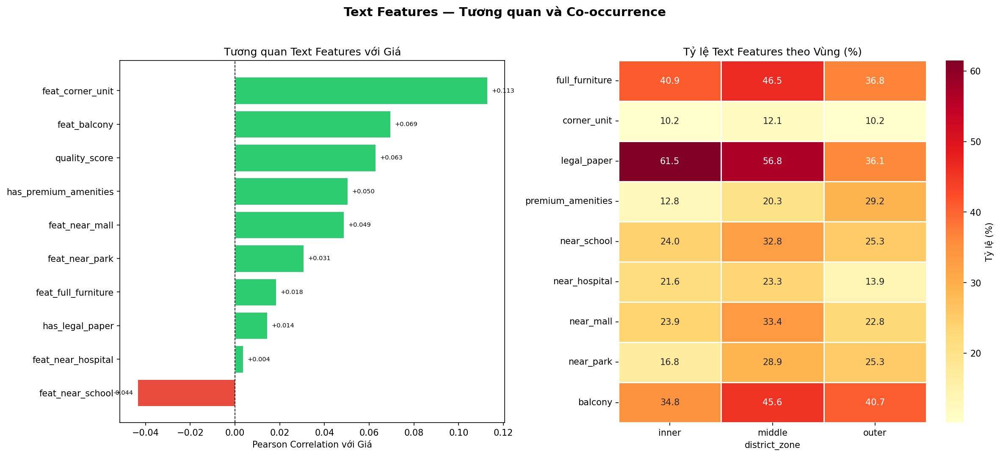

**Phát hiện:** `feat_near_school` có r = **−0,044** với giá — đi ngược kỳ vọng "gần trường tốt = giá cao".

**Lý giải confounding địa lý:** Từ khóa "gần trường học" xuất hiện nhiều ở các quận Middle và Outer Zone đang phát triển (Nam Từ Liêm, Hà Đông, Hoàng Mai) — những nơi có giá thấp hơn Inner Zone. Dataset học tín hiệu: "gần trường = vùng ngoại vi = giá thấp hơn" thay vì quan hệ nhân quả thực.

**Xử lý đúng đắn:** Feature vẫn được giữ trong pipeline vì LightGBM học được **tương tác ngữ cảnh** (`district × near_school`) tốt hơn correlation đơn biến âm. Khi kết hợp với `district_name`, LightGBM có thể nhận diện: "gần trường ở Ba Đình = premium; gần trường ở Hà Đông = không premium".

### Dị kỳ 4 — Premium Amenities cao nhất ở Outer Zone (Plot 12 — `eda_12`)

**Phát hiện:** Tỷ lệ đề cập `has_premium_amenities` (hồ bơi, gym) cao nhất ở **Outer Zone (29,2%)**, cao hơn hẳn Inner Zone (12,8%):

| Feature | Inner | Middle | Outer |
|---|---|---|---|
| `has_premium_amenities` | 12,8% | 20,3% | **29,2%** |
| `has_legal_paper` | **61,5%** | 56,8% | 36,1% |

**Lý giải chiến lược marketing:** Các chủ đầu tư ngoại thành (Vinhomes, Ecopark) dùng hồ bơi/gym như **công cụ cạnh tranh** để bù đắp cho vị trí kém hơn. Ngược lại, Inner Zone không cần "bán bằng tiện ích" vì premium vị trí đã tự nói lên giá trị.

**Insight cho EDA:** Tỷ lệ đề cập văn bản phản ánh **chiến lược marketing**, không chỉ đặc điểm vật lý căn hộ. LightGBM khi kết hợp `has_premium_amenities` với `district_zone` sẽ học được pattern này.

---

## 4.6. Tổng kết — Cơ sở Lựa chọn Mô hình

> **Mục tiêu:** Xâu chuỗi tất cả luận điểm thành mệnh đề chốt hạ: TẠI SAO chọn K-Means và TẠI SAO chọn LightGBM với các features này.

### Tại sao K-Means?

EDA đã cung cấp **3 bằng chứng cụ thể** cho thấy thị trường có cấu trúc cluster thực sự:

1. **PCA xác nhận 3 chiều độc lập có ý nghĩa kinh tế:** Size (PC1=50,3%), Price Quality (PC2=20,6%), Location (PC3=16,6%) — tổng 87,6% variance. Ba chiều này tự nhiên tạo ra các nhóm tách biệt.

2. **Phân hóa Zone rõ ràng nhưng không đủ chi tiết:** Violin plot và scatter theo zone cho thấy Inner và Middle chồng lên nhau đáng kể trên trục giá tuyệt đối — Zone (3 nhóm) không đủ fine-grained. K-Means trên 6 features có thể tìm ra phân khúc tốt hơn "chỉ dùng địa lý".

3. **Phân khúc giá không phải continuum:** Phân bố giá có đỉnh rõ tại 4–8 tỷ (43% cung) và tail dài — đây là dấu hiệu của thị trường nhiều phân khúc khác biệt, không phải gradient đồng nhất.

> **K-Means** phù hợp để trả lời: *"Thị trường này tự nhiên chia thành mấy phân khúc? Dung mạo từng phân khúc ra sao?"* — câu hỏi mà zone địa lý thô sơ không đủ trả lời.

### Tại sao LightGBM?

EDA phát hiện **4 đặc điểm dữ liệu** cho thấy LightGBM là lựa chọn tối ưu hơn Linear Regression hay các model tuyến tính:

1. **Tương tác phi tuyến bậc cao:** "Nghịch lý Studio × Inner Zone" (giá/m² Studio > Penthouse tại nội thành) là tương tác không thể biểu diễn bằng hệ số tuyến tính. LightGBM xử lý tự động qua cây quyết định.

2. **Confounding địa lý phức tạp:** `feat_near_school` âm ở mức toàn cục nhưng có thể dương trong context cụ thể (Inner Zone). LightGBM học được tương tác ngữ cảnh này; Linear Regression chỉ áp dụng hệ số toàn cục.

3. **Biến rời rạc step-wise:** `bedroom_count` tạo pattern bậc thang trong pair plot — mỗi bậc phòng ngủ ứng với dải giá khác biệt. Tree-based model học pattern này tự nhiên.

4. **Nhiều features heterogeneous:** 36 features bao gồm liên tục (log_price, area), rời rạc (bedroom_count), nhị phân (9 text features), categorical encoded (district, zone), thời gian (pub_month) — LightGBM xử lý hỗn hợp này không cần tiền xử lý phức tạp thêm.

### Chuỗi tri thức K-Means → LightGBM

```
K-Means (Unsupervised)          LightGBM (Supervised)
      ↓                               ↓
Phân cụm 72.604 căn    →    Nhãn Cluster là Feature bổ sung
theo 6 chiều đặc trưng  →    giải thích tương tác phân khúc
      ↓                               ↓
"Thị trường phân mảnh          "Giá chịu tác động khác nhau
 thành mấy nhóm thực?"          theo từng phân khúc thị trường"
```

**Pipeline liên kết** (không phải 2 model độc lập): nhãn Cluster từ K-Means đóng vai trò categorical feature, giúp LightGBM phân biệt được rằng *cùng diện tích 80m² nhưng ở Cluster "cao cấp nội thành" hay Cluster "đại trà ngoại thành" thì giá khác nhau đáng kể*. EDA đã chứng minh rằng Zone (3 nhóm thô) chưa đủ granularity — K-Means sẽ tạo ra phân nhóm tinh xảo hơn mà LightGBM có thể học.

### Tóm tắt Kiến trúc Phân tích

| Chiều phân tích | Phát hiện chính | Hệ quả cho Mô hình |
|---|---|---|
| Phân hóa địa lý | Phường quyết định > Quận; Tây Hồ là outlier dương | `ward_name` là feature địa lý cốt lõi |
| Phân khúc giá | 4–8 tỷ chiếm 43% — thị trường đại chúng | Optimize MAE tại dải này |
| Hành vi phi tuyến | Studio×Inner = giá/m² cao nhất | LightGBM bắt tương tác chéo |
| Xu hướng thời gian | +21% giá trong 7 tháng | `pub_month` là predictor thời gian |
| Text features | Corner unit (+0,11) dẫn đầu; near_school âm | Giữ toàn bộ — LightGBM phân biệt context |
| Cấu trúc PCA | 87,6% variance trong 3 PC | K-Means sẽ cho cluster có nghĩa kinh tế |
