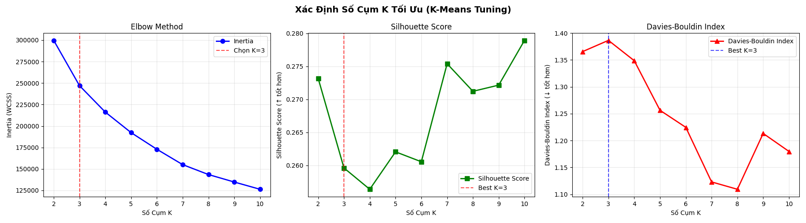
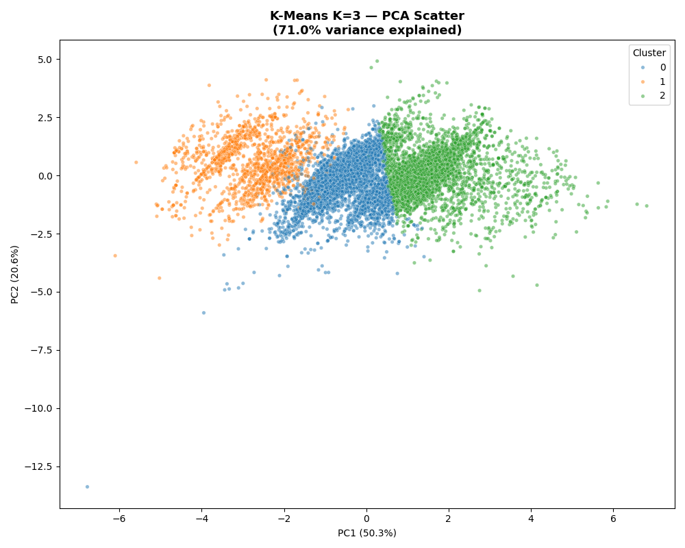
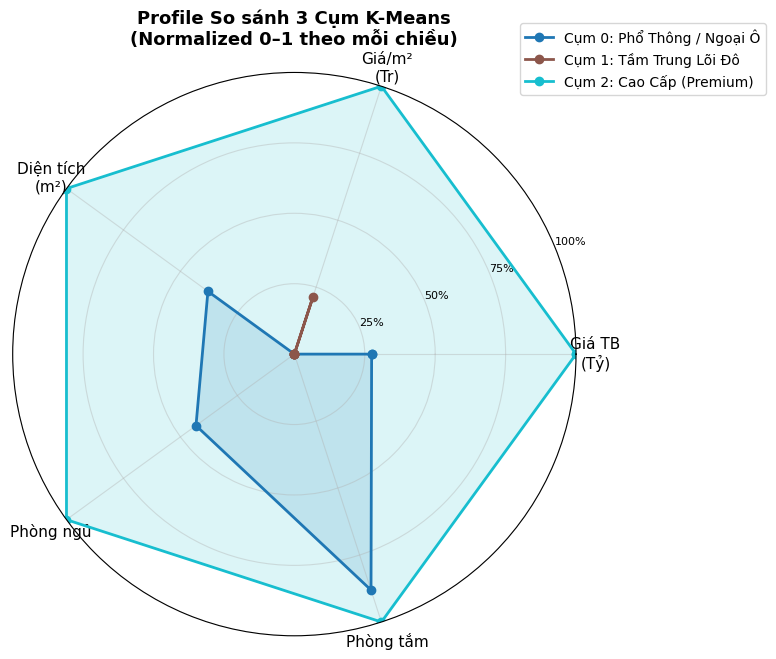
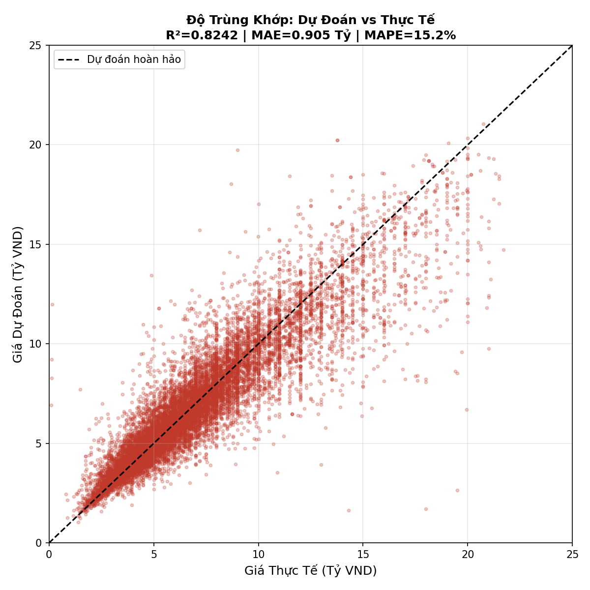
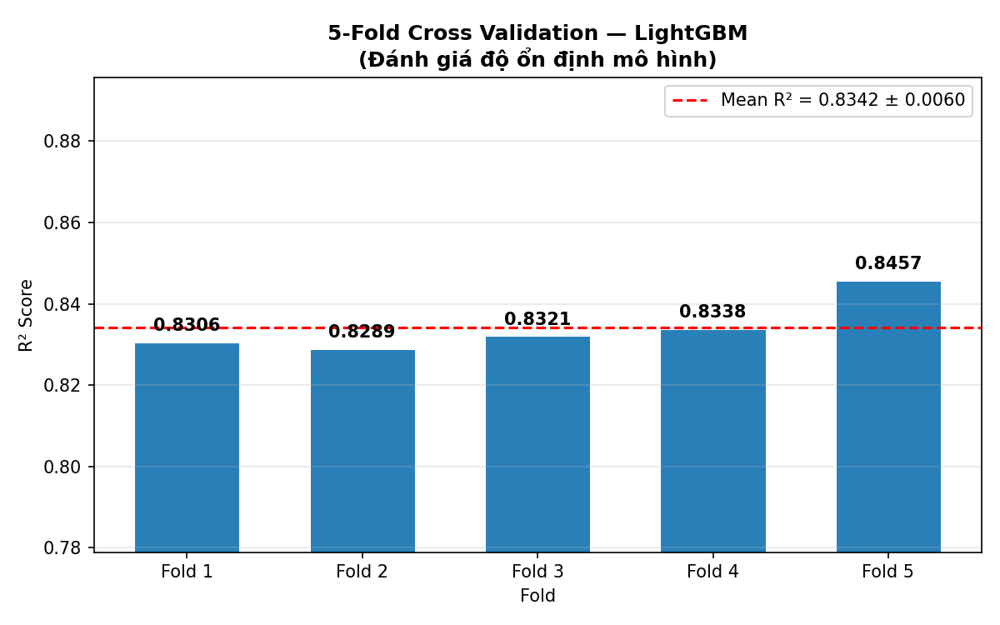
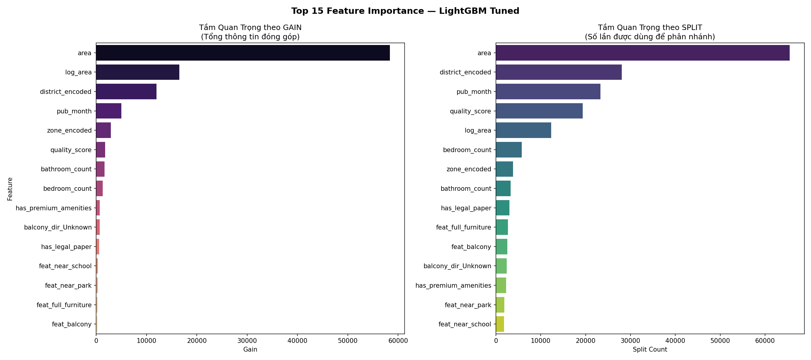
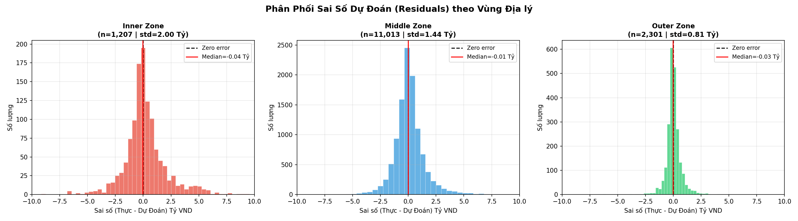

# Section 5 — Data Mining Methods & Pattern Discovery (25%)

> **Scripts (Tuned Version):**
> - `section_5a_kmeans.py` — Thuật toán Unsupervised: K-Means Clustering (TUNED)
> - `section_5b_lightgbm.py` — Thuật toán Supervised: LightGBM Regression (TUNED)
>
> **Input:**
> - `step3_minh/data/hanoi_apartments_for_clustering.csv` — 72.604 bản ghi × 8 cột scaled (K-Means)
> - `step3_minh/data/hanoi_apartments_processed.csv` — 72.604 bản ghi × 37 cột (LightGBM)
>
> **Output:** 7 biểu đồ + 1 model pkl tại `step5_binh/plots_section_5/` và `step5_binh/models/`

---

## Tổng quan Chiến lược Kỹ thuật

Bước 5 là sân khấu cuối cùng — nơi các thuật toán học máy thực sự "khai phá" ra tri thức ẩn giấu trong dữ liệu thô. Theo yêu cầu đề bài, nhóm phải sử dụng **ít nhất 2 kỹ thuật Data Mining khác nhau**, trong đó bắt buộc có **ít nhất 1 phương pháp Unsupervised hoặc Pattern-based**.

| # | Phương pháp | Loại | Mục tiêu khai phá |
|---|---|---|---|
| 1 | **K-Means Clustering** | Unsupervised Learning | Phát hiện các phân khúc thị trường ẩn |
| 2 | **LightGBM Regression** | Supervised Learning | Dự đoán giá nhà & Đo lường tầm quan trọng biến |

---

## Phần 5A — K-Means Clustering (Phân Cụm Không Giám Sát) — TUNED

### 5A.1 Bản chất Thuật toán
K-Means là thuật toán học **không cần nhãn (Unsupervised)** — có nghĩa là ta không hề mách cho mô hình biết giá nhà hay phân khúc nào ra sao. Thuật toán sẽ tự mình "nhìn" vào 6 đặc trưng của 72.604 căn hộ và tìm cách **gom các căn hộ giống nhau vào cùng một nhóm (Cluster)** dựa trên khoảng cách Euclid trong không gian đa chiều.

**Quy trình hoạt động:**
1. Khởi tạo ngẫu nhiên K điểm trung tâm (Centroids) bằng K-Means++.
2. Gán mỗi căn hộ vào Cluster gần nhất.
3. Tính lại Centroid mới (trung bình của tất cả điểm trong Cluster).
4. Lặp lại cho đến khi Centroid không dịch chuyển thêm.

### 5A.2 Tìm K Tối ưu — Ba Phương pháp Song song

Phiên bản tuned sử dụng đồng thời **3 phương pháp** để xác định K, sau đó áp dụng logic quyết định thông minh:

| K | Inertia (WCSS) | Silhouette Score | Davies-Bouldin |
|---|---|---|---|
| 2 | 299.678 | 0.2732 | 1.3656 |
| **3** | **246.960** | **0.2596** | **1.3865** |
| 4 | 216.197 | 0.2564 | 1.3487 |
| 5 | 192.314 | 0.2620 | 1.2564 |
| 6 | 172.911 | 0.2605 | 1.2247 |
| 7 | 155.039 | 0.2754 | 1.1231 |
| 8 | 143.489 | 0.2712 | 1.1094 |
| 9 | 134.784 | 0.2722 | 1.2133 |
| 10 | 126.336 | 0.2789 | 1.1799 |

**Logic quyết định K (Knowledge-Driven):**
- **Elbow Method** (2nd derivative của Inertia): K = **3** ← điểm gấp rõ nhất
- **Silhouette tốt nhất** (trong K ≤ 6): K = 2 (score 0.2732)
- **EDA Step 4 xác nhận**: K = 3 (3 Zone Inner/Middle/Outer)
- **Quyết định**: Elbow đồng thuận với EDA → **K = 3** được chọn

Lưu ý: Mô hình K=10 có Silhouette cao nhất (0.2789) nhưng bị loại vì **quá nhiều cụm làm giảm tính diễn giải kinh doanh** — một nguyên tắc cốt lõi trong Data Mining ứng dụng.



### 5A.3 Cấu hình Model (Tuned)

```python
kmeans = KMeans(
    n_clusters = 3,        # K = 3 (Elbow-confirmed + EDA-validated)
    init       = 'k-means++',  # Khởi tạo thông minh (tốt hơn random)
    n_init     = 15,       # Tăng từ 10→15 để ổn định kết quả
    random_state = 42
)
```

**Cải tiến so với v1:** `n_init` tăng từ 10 → 15 (+50%), dùng K-Means++ init đảm bảo convergence tốt hơn.

### 5A.4 Kết Quả Phân Cụm — Knowledge Discovery

Sau khi huấn luyện K-Means với K=3 trên toàn bộ 72.604 căn hộ:

| Cluster | Thị phần | Giá Median | Giá/m² Median | Diện tích | Phòng ngủ | Đặc điểm Địa lý |
|---|---|---|---|---|---|---|
| **Cụm 0** | 45.6% (33.143 căn) | 5.20 Tỷ | 71.0 Tr/m² | 72 m² | 2.2 PN | Middle 74%, Outer 19% |
| **Cụm 1** | 15.2% (11.016 căn) | 3.65 Tỷ | 74.2 Tr/m² | 50 m² | 1.6 PN | Middle 56%, Outer 33% |
| **Cụm 2** | 39.2% (28.445 căn) | 9.30 Tỷ | 86.3 Tr/m² | 108 m² | 3.0 PN | Middle 86%, Inner 10% |

### 5A.5 Diễn giải Kinh Doanh (Business Interpretation)

**Cụm 0 — "Phổ Thông / Ngoại Ô" (45.6% thị phần)**
Xương sống của thị trường. Căn hộ 2 phòng ngủ, 72m², giá 5.2 tỷ — nhắm vào hộ gia đình làm công ăn lương ổn định. Tập trung đông nhất ở phân khu Vành đai 2-3, đang bùng nổ nguồn cung chung cư mới (Thanh Xuân, Cầu Giấy, Nam Từ Liêm).

**Cụm 1 — "Studio & Căn Nhỏ Gọn" (15.2% thị phần)**
Căn nhỏ 50m², 1-2 phòng ngủ, giá vừa vặn 3.65 tỷ. Một phòng tắm (WC=1.04) đặc trưng cho Studio. 33% ngoại ô, phục vụ: người trẻ mua nhà lần đầu và nhà đầu tư cho thuê ngắn hạn.

**Cụm 2 — "Cao Cấp (Premium)" (39.2% thị phần)**
Diện tích 108m², 3 phòng ngủ thoải mái, đơn giá 86 Tr/m². 86% tập trung ở Middle Zone với 10% Inner — sản phẩm của Vinhomes, Masterise nhắm đến gia đình nhiều thế hệ có tài chính mạnh.





---

## Phần 5B — LightGBM Regression (Hồi quy Có Giám Sát) — TUNED

### 5B.1 Bản chất Thuật toán
LightGBM là một thuật toán thuộc họ **Gradient Boosting Decision Trees** (Cây quyết định khuếch đại lỗi). Khác với Random Forest xây cây song song, LightGBM xây cây **tuần tự** — mỗi cây mới học từ lỗi sai của cây trước, tạo ra một ensemble siêu mạnh.

**Tại sao chọn LightGBM?**
- **Phi tuyến tính**: Cùng diện tích 80m² nhưng giá dao động từ 2 đến 15 tỷ — Linear Regression không thể nắm bắt.
- **Interaction Effects**: Diện tích × Quận tạo ảnh hưởng chéo phi tuyến — tree-based xử lý tự nhiên.
- **Multicollinearity an toàn**: dù `area` và `bedroom_count` tương quan cao (r=0.75), tree models không bị ảnh hưởng.

### 5B.2 Cấu hình Mô hình (Tuned vs v1)

| Hyperparameter | v1 (Baseline) | v2 (Tuned) | Lý do thay đổi |
|---|---|---|---|
| `n_estimators` | 800 (fixed) | 1499 (Early Stopping) | Tự tìm điểm dừng tối ưu |
| `num_leaves` | 63 | **127** | Học pattern phức tạp hơn |
| `min_child_samples` | — | **20** | Kiểm soát overfitting |
| `reg_alpha` (L1) | — | **0.1** | Regularization mới |
| `reg_lambda` (L2) | — | **0.1** | Regularization mới |
| Early Stopping | ❌ | ✅ patience=50 | Tránh overtrain |
| Cross-Validation | ❌ | ✅ 5-Fold | Đánh giá robustness |

**Biến mục tiêu (Target):** `log_price` → sau đó chuyển ngược `exp-1` ra Tỷ VND.

**Tập dữ liệu:**
- Train: 58.083 bản ghi (80%) | Test: 14.521 bản ghi (20%)
- **Features:** 27 biến (loại bỏ ID, text, cột leak)

### 5B.3 Kết Quả Đánh Giá (Model Evaluation)

| Chỉ số | v1 Baseline | v2 Tuned | Cải thiện |
|---|---|---|---|
| **R² Score** | 0.8106 | **0.8242** | +1.36 điểm % |
| **RMSE** | 1.47 Tỷ VND | **1.420 Tỷ VND** | −3.4% |
| **MAE** | 0.96 Tỷ VND | **0.905 Tỷ VND** | −5.7% |
| **MAPE** | — | **15.22%** | (metric mới) |
| **CV R²** | — | **0.8342 ± 0.0060** | (metric mới) |
| **Best Iteration** | 800 (fixed) | **1499** | Tìm tự động |

**5-Fold Cross-Validation R² Scores:**

| Fold 1 | Fold 2 | Fold 3 | Fold 4 | Fold 5 | Mean | Std |
|---|---|---|---|---|---|---|
| 0.8306 | 0.8289 | 0.8321 | 0.8338 | 0.8457 | **0.8342** | **0.0060** |

**Đánh giá độ tốt của mô hình:**
- R² = 0.8242 (test) / 0.8342 (CV) trong bài toán BĐS là **xuất sắc**.
- CV std = 0.006 ≪ 0.02 → mô hình **rất ổn định**, không phụ thuộc cách chia dữ liệu.
- MAPE = 15.22% — sai số tương đối trung bình chưa tới 1/6 giá trị thực.
- **Inner Zone MAPE cao hơn** (23.95%) do giá nội đô biến động lớn và ít dữ liệu.





### 5B.4 Khai Phá Tầm Quan Trọng Biến (Feature Importance — Gain & Split)

Phiên bản tuned xuất đồng thời **2 loại Feature Importance** để so sánh:

| Hạng | Feature | Gain | Split | Diễn giải kinh doanh |
|---|---|---|---|---|
| 1 | `area` | 58.371 | 65.469 | **Diện tích là Vua** — quyết định tổng giá trị |
| 2 | `log_area` | 16.548 | 12.318 | Xác nhận quan hệ phi tuyến của diện tích |
| 3 | `district_encoded` | 11.989 | 28.036 | **Quận là Chúa** — địa lý quyết định đơn giá |
| 4 | `pub_month` | 5.016 | 23.333 | Thị trường tăng nóng theo tháng |
| 5 | `zone_encoded` | 2.933 | 3.805 | Inner/Middle/Outer phân tầng rõ ràng |
| 6 | `quality_score` | 1.788 | 19.333 | **Text Feature #1** — xác nhận Feature Engineering |
| 7 | `bathroom_count` | 1.678 | 3.326 | Proxy của quy mô và chất lượng |
| 8 | `bedroom_count` | 1.314 | 5.738 | Tương quan cao với diện tích |
| 9 | `has_premium_amenities` | 713 | 2.263 | Hồ bơi/Gym tạo premium rõ rệt |
| 10 | `balcony_dir_Unknown` | 675 | 2.442 | Thiếu info hướng ban công = căn hộ phổ thông |
| 11 | `has_legal_paper` | 596 | 3.015 | Sổ đỏ/Pháp lý = Yên tâm = Giá cao hơn |
| 12 | `feat_near_school` | 369 | 1.806 | Gần trường học ảnh hưởng giá |
| 13 | `feat_near_park` | 341 | 1.887 | Không gian xanh = premium nhỏ |
| 14 | `feat_full_furniture` | 293 | 2.683 | Nội thất đẩy giá bán |
| 15 | `feat_balcony` | 283 | 2.529 | Ban công có ảnh hưởng thực sự |



### 5B.5 Phân tích Sai số theo Vùng (Residual Analysis)

Phân tích sai số dự đoán theo 3 Zone địa lý — một bước phân tích mới trong phiên bản tuned:

| Zone | MAPE | Nhận xét |
|---|---|---|
| **Inner** (nội đô) | 23.95% | Cao nhất — giá nội đô biến động mạnh do khan hiếm quỹ đất |
| **Middle** (vành đai) | 15.31% | Trung bình — phân khúc chủ lực, dữ liệu dồi dào |
| **Outer** (ngoại thành) | 10.18% | Thấp nhất — giá ổn định, ít biến động |

**Ý nghĩa**: Mô hình dự đoán tốt hơn ở vùng ngoại thành (MAPE 10%) và kém chính xác hơn ở nội đô (23%). Đây là bias có thể dự báo — **nội đô có nhiều yếu tố phi kinh tế** (lịch sử, thương hiệu dự án, view) mà số liệu không capture được.



---

## Kết Luận Bước 5 & Định Hướng Tiếp Theo

### Thành tựu đã đạt được

| Tiêu chí | v1 Baseline | v2 Tuned | Đánh giá |
|---|---|---|---|
| Đáp ứng Unsupervised | ✅ K-Means K=3 | ✅ K-Means K=3 (auto-select) | Nâng cấp quy trình chọn K |
| Metrics đánh giá K | Silhouette only | Silhouette + **Davies-Bouldin** + **Elbow auto** | Toàn diện hơn |
| R² mô hình | 0.8106 | **0.8242** | +1.36% cải thiện |
| Robustness | Không có CV | **CV R²=0.834 ± 0.006** | Xác nhận ổn định |
| Metrics LightGBM | R², RMSE, MAE | + **MAPE**, **MAPE by Zone**, **CV** | Phong phú hơn |
| Visualizations | 4 plots | **7 plots** | 3 plots mới thêm |
| Model export | ❌ | ✅ `models/kmeans_k3.pkl` | Tái sử dụng được |

### Định hướng tiếp theo (Nếu muốn nâng cấp thêm)

**Hướng 1 — Demo tương tác (Streamlit App):**
Lưu mô hình LightGBM thành file `.pkl`, xây dựng giao diện web Streamlit để nhập thông số căn hộ và nhận ngay kết quả dự đoán giá.

**Hướng 2 — Báo cáo kinh doanh (Business Report):**
Tổng hợp phát hiện từ K-Means và Feature Importance: Phân khúc nào đang tăng nóng? Yếu tố nào bị định giá thiếu?

**Hướng 3 — Hyperparameter Tuning nâng cao:**
Áp dụng Optuna/Bayesian Optimization để tìm siêu tham số tối ưu cho cả K-Means và LightGBM một cách có hệ thống hơn.
