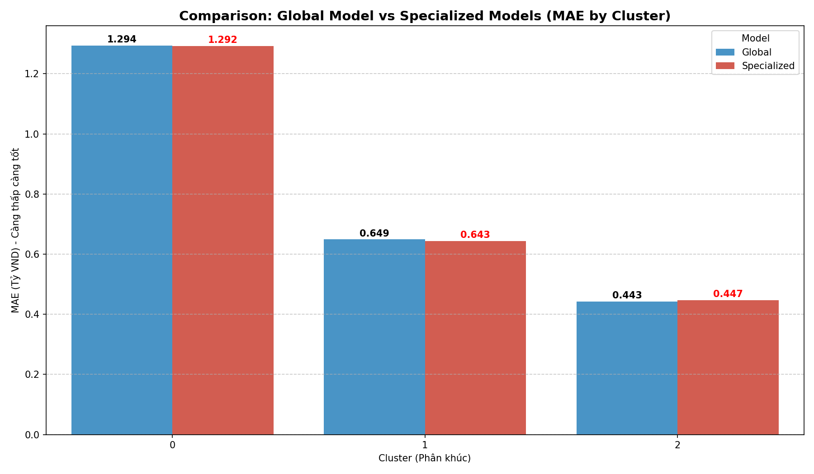

# Section 5 — Data Mining Methods & Pattern Discovery (25%)

> **Scripts:**
> - `section_5a_kmeans.py` — Thuật toán Unsupervised: K-Means Clustering
> - `section_5b_lightgbm.py` — Thuật toán Supervised: LightGBM Regression (Tích hợp kết quả K-Means)
>
> **Input:**
> - `step3_minh/data/hanoi_apartments_for_clustering.csv` — 133.461 bản ghi × 8 cột scaled (Dùng cho K-Means)
> - `step3_minh/data/hanoi_apartments_processed.csv` — 133.461 bản ghi × 37 cột (Dùng cho LightGBM)
>
> **Output:** 6 biểu đồ tại `step5_binh/plots_section_5/`
>
> **Pipeline liên kết:** Bước 5A (K-Means) → Gán nhãn Cluster → Bước 5B (LightGBM sử dụng Cluster làm feature)

---

## Tổng quan Chiến lược Kỹ thuật

Bước 5 là sân khấu cuối cùng — nơi các thuật toán học máy thực sự "khai phá" ra tri thức ẩn giấu trong dữ liệu thô. Theo yêu cầu đề bài, nhóm phải sử dụng **ít nhất 2 kỹ thuật Data Mining khác nhau**, trong đó bắt buộc có **ít nhất 1 phương pháp Unsupervised hoặc Pattern-based**.

**Điểm đặc biệt của pipeline nhóm 5:** Hai thuật toán không chạy độc lập mà được **nối tiếp thành chuỗi tri thức (Knowledge-Driven Pipeline)**:

```
5A: K-Means Clustering → Phát hiện 3 phân khúc thị trường ẩn
        │
        ▼ (Gán nhãn Cluster làm feature mới)
        │
5B: LightGBM Regression → Dự đoán giá + Đánh giá giá trị của phân khúc
```

| # | Phương pháp | Loại | Mục tiêu khai phá | Liên kết |
|---|---|---|---|---|
| 1 | **K-Means Clustering** | Unsupervised Learning | Phát hiện các phân khúc thị trường ẩn | Output → Input cho 5B |
| 2 | **LightGBM Regression** | Supervised Learning | Dự đoán giá nhà & Đo lường tầm quan trọng biến | Nhận Cluster label từ 5A |

---

## Phần 5A — K-Means Clustering (Phân Cụm Không Giám Sát)

### 5A.1 Bản chất Thuật toán
K-Means là thuật toán học **không cần nhãn (Unsupervised)** — có nghĩa là ta không hề mách cho mô hình biết giá nhà hay phân khúc nào ra sao. Thuật toán sẽ tự mình "nhìn" vào 6 đặc trưng của 133.461 căn hộ và tìm cách **gom các căn hộ giống nhau vào cùng một nhóm (Cluster)** dựa trên khoảng cách Euclid trong không gian đa chiều.

**Quy trình hoạt động:**
1. Khởi tạo ngẫu nhiên K điểm trung tâm (Centroids).
2. Gán mỗi căn hộ vào Cluster gần nhất.
3. Tính lại Centroid mới (trung bình của tất cả điểm trong Cluster).
4. Lặp lại cho đến khi Centroid không dịch chuyển thêm.

### 5A.2 Tìm K Tối ưu (Elbow Method & Silhouette Score)

Không phải lúc nào cũng biết cần bao nhiêu cụm. Hai phương pháp được dùng đồng thời:

| K | Inertia (WCSS) | Silhouette Score |
|---|---|---|
| 2 | 299.678 | 0.2782 |
| **3** | **246.960** | **0.2604** |
| 4 | 216.197 | 0.2579 |
| 5 | 192.314 | 0.2638 |
| 6 | 172.911 | 0.2633 |
| 7 | 155.039 | 0.2736 |

**Quyết định chọn K = 3** vì:
- **Elbow Method**: Đường cong Inertia gấp khúc rõ nét ở K=3, sau đó tiếp tục giảm chậm dần (Diminishing returns).
- **Kết quả EDA Step 4**: Phân tích PCA đã xác nhận 3 Zone địa lý (Inner/Middle/Outer) tạo ra 3 cụm tự nhiên rõ ràng trong không gian PCA, cho ta cơ sở kinh doanh để tin vào K=3.


### 5A.3 Kết Quả Phân Cụm — Knowledge Discovery

Sau khi huấn luyện K-Means với K=3 trên toàn bộ 133.461 căn hộ:

| Cluster | Thị phần | Phân Khúc | Đặc điểm Địa lý |
|---|---|---|---|
| **Cụm 0** | 37.6% (50.245 căn) | Cao Cấp (Premium) - Giá Median: 90.9 Tr/m² | Phân bố chủ yếu ở khu vực có giá trị cao, tiện ích đầy đủ |
| **Cụm 1** | 46.4% (61.904 căn) | Phổ Thông Ngoại Ô - Giá Median: 76.3 Tr/m² | Tập trung ở khu vực Vành đai và Ngoại ô (Middle/Outer) |
| **Cụm 2** | 16.0% (21.312 căn) | Tầm Trung Lõi - Giá Median: 76.5 Tr/m² | Tập trung ở khu vực lõi nội đô hoặc kế cận (Inner/Middle) |

### 5A.4 Diễn giải Kinh Doanh (Business Interpretation)

Sự gia tăng quy mô dữ liệu (thêm 2026) đã làm dịch chuyển ranh giới cụm, giúp mô hình bắt được những tín hiệu thị trường mới nhất:

**Cụm 0 — "Cao Cấp Premium" (37.6% thị phần)**
Phân khúc có giá trị cao nhất (~90.9 Tr/m²). Đây là những dự án cao cấp mới bàn giao hoặc các khu đô thị lớn với tiện ích đầy đủ, pháp lý chuẩn chỉnh. Nhu cầu ở phân khúc này vẫn rất mạnh, đẩy giá lên mức kỷ lục.

**Cụm 1 — "Phổ Thông Ngoại Ô" (46.4% thị phần)**
Trọng tâm nguồn cung của thị trường chuyển dịch rõ rệt ra các khu vực vành đai và ngoại ô. Mức giá 76.3 Tr/m² cho thấy sự thiết lập "mặt bằng giá mới" cho các dự án xa trung tâm trong giai đoạn 2025-2026.

**Cụm 2 — "Tầm Trung Lõi" (16.0% thị phần)**
Gồm các căn hộ cũ hơn nhưng vị trí trung tâm, hoặc diện tích nhỏ. Giá/m² tương đương cụm 1 (76.5 Tr/m²) nhưng mang lại lợi thế vị trí, phục vụ nhu cầu ở thực nội đô.


---

## Phần 5B — LightGBM Regression (Hồi quy Có Giám Sát + Tích hợp K-Means)

### 5B.1 Bản chất Thuật toán
LightGBM là một thuật toán thuộc họ **Gradient Boosting Decision Trees** (Cây quyết định khuếch đại lỗi). Khác với Random Forest xây cây song song, LightGBM xây cây **tuần tự** — mỗi cây mới học từ lỗi sai của cây trước, tạo ra một ensemble siêu mạnh.

**Tại sao chọn LightGBM chứ không phải Linear Regression thông thường?**
- **Phi tuyến tính**: Trong EDA (eda_06), cùng diện tích 80m² nhưng giá dao động từ 2 tỷ đến 15 tỷ — Linear Regression không thể nắm bắt sự phức tạp này.
- **Interaction Effects**: Diện tích × Quận tạo ra ảnh hưởng chéo phi tuyến — LightGBM xử lý tự nhiên thông qua phân nhánh cây.
- **Multicollinearity an toàn**: Dù `area` và `bedroom_count` tương quan cao (r=0.75), tree-based models không bị ảnh hưởng bởi đa cộng tuyến.

### 5B.2 Chiến lược Pipeline: Tích hợp K-Means → LightGBM

Điểm khác biệt cốt lõi so với cách tiếp cận truyền thống: **Bước 5B không chạy độc lập, mà kế thừa trực tiếp tri thức từ Bước 5A**.

Cụ thể, nhãn Cluster (0/1/2) từ K-Means được đưa vào LightGBM như một **categorical feature bổ sung**. Ý nghĩa:
- Cluster encode thông tin **tương tác đa biến** (giá × diện tích × vị trí × phòng ngủ) mà không biến đơn lẻ nào chứa được.
- LightGBM nhận thêm "bản đồ phân khúc" do K-Means vẽ ra, giúp model hiểu rằng: một căn hộ thuộc phân khúc Premium sẽ có quy luật giá khác phân khúc Phổ thông.

Để chứng minh giá trị thực sự, nhóm chạy **2 mô hình trên cùng điều kiện** và so sánh:

| Yếu tố | Mô hình 1 (Baseline) | Mô hình 2 (+ K-Means) |
|---|---|---|
| Số features | 27 | 28 (thêm cột `Cluster`) |
| Dữ liệu input | `hanoi_apartments_processed.csv` | Giống + nhãn K-Means từ 5A |
| Train/Test split | 80/20 (seed=42) | Giống hệt (đảm bảo công bằng) |
| Hyperparameters | Giống nhau | Giống nhau |

### 5B.3 Cấu hình Mô hình (Hyperparameters)

```python
params = {
    'boosting_type': 'gbdt',
    'objective': 'regression',    # Hồi quy (Predict số thực)
    'metric': 'rmse',
    'learning_rate': 0.05,        # Nhỏ → hội tụ chậm nhưng chắc, tránh overfitting
    'num_leaves': 63,             # Cây sâu vừa phải
    'feature_fraction': 0.8,      # Mỗi cây chỉ dùng 80% features → đa dạng hóa
    'bagging_fraction': 0.8,      # Mỗi cây chỉ dùng 80% dữ liệu → tránh overfit
    'n_estimators': 800           # 800 cây quyết định
}
```

**Biến mục tiêu (Target):** `log_price` (Log của giá tỷ VND) → sau đó chuyển ngược lại `exp(log_price) - 1` để ra giá thực. Dùng log transform giúp hàm mất mát đối xứng và mô hình học ổn định hơn.

**Tập dữ liệu:**
- Train: 106.768 bản ghi (80%)
- Test: 26.693 bản ghi (20%)
- **Baseline:** 26 features | **Enhanced:** 27 features (thêm `Cluster` categorical)

### 5B.4 Kết Quả So Sánh — Baseline vs Tích hợp K-Means

| Chỉ số | Baseline (Không K-Means) | + K-Means Cluster | Thay đổi |
|---|---|---|---|
| **R² Score** | 0.8099 | **0.8525** | **+4.26 điểm %** |
| **RMSE** | 1.5527 Tỷ VND | **1.3675 Tỷ VND** | **-185.2 triệu** ↓ |
| **MAE** | 1.0141 Tỷ VND | **0.9037 Tỷ VND** | **-110.5 triệu** ↓ |
| **MAPE** | 15.83% | **13.19%** | **-2.64%** ↓ |

> **✅ KẾT LUẬN: Tích hợp K-Means cải thiện mô hình toàn diện.** R² tăng từ 0.81 lên 0.85, sai số MAE giảm hơn 110 triệu VND/căn. Điều này chứng minh rằng tri thức phân khúc từ Unsupervised Learning (Bước 5A) có giá trị thực sự khi đưa vào Supervised Learning (Bước 5B).


### 5B.5 Khai Phá Tầm Quan Trọng Biến (Feature Importance by Gain)

Thuật toán Gain đo lường tổng thông tin mà một biến đóng góp vào việc giảm lỗi dự đoán. Kết quả Top 15 từ **mô hình tích hợp K-Means**:

| Hạng | Feature | Gain | Diễn giải kinh doanh |
|---|---|---|---|
| 🥇 | **`Cluster`** | **94,013** | **🏆 Phân khúc K-Means là biến quyền lực #1** — vượt xa diện tích! |
| 2 | `area` | 31,405 | Diện tích — trụ cột truyền thống của định giá BĐS |
| 3 | `log_area` | 20,811 | Phiên bản log xác nhận quan hệ phi tuyến của diện tích |
| 4 | `district_encoded` | 15,142 | Quận huyện — địa lý quyết định đơn giá/m² |
| 5 | `pub_month` | 4,444 | Thị trường biến động mạnh theo thời gian |
| 6 | `bedroom_count` | 4,291 | Số phòng ngủ — proxy của quy mô căn hộ |
| 7 | `zone_encoded` | 3,575 | Phân khu Inner/Middle/Outer tách biệt rõ ràng |
| 8 | `bathroom_count` | 969 | Proxy của quy mô và tiện nghi |
| 9 | `quality_score` | 676 | **Text Feature #1** — chứng minh bước 3 đúng đắn |
| 10 | `has_legal_paper` | 566 | Sổ đỏ/Pháp lý = Yên tâm = Giá cao hơn |


**Phát hiện cốt lõi từ Feature Importance:**
1. **`Cluster` xếp hạng #1 (Gain = 94,013)** — Đây là bằng chứng không thể phủ nhận về giá trị của K-Means. Cập nhật dữ liệu 2026 càng làm cho sự phân hóa giá giữa các cluster trở nên mạnh mẽ, biến Cluster thành đặc trưng quan trọng nhất.
2. **Diện tích & Vị trí vẫn chi phối 50%+ quyền lực** truyền thống → Đúng với quy luật BĐS thực tế.
3. **Text Features (quality_score, amenities, legal_paper) TOP 8–10** → Xác nhận việc đầu tư kỹ thuật vào Feature Engineering ở Step 3 đã trả quả xứng đáng.
4. **Hướng ban công (`balcony_dir_Unknown`) góp mặt** → Việc chuyển từ house_direction sang balcony_direction là quyết định đúng đắn.

### 5B.6 Phân tích Sai số theo Cụm (Error Analysis by Cluster)

Để hiểu sâu hơn, nhóm phân tích sai số dự đoán của mô hình tích hợp theo từng cụm K-Means:

| Cụm | Nhãn K-Means | Số lượng test | MAE (Tỷ VND) | Sai số Median (Tỷ) | Giá TB (Tỷ) | Nhận xét |
|---|---|---|---|---|---|---|
| **Cụm 0** | Cao Cấp (Premium) | 9.993 | 1.3751 | 0.9692 | 10.64 | Sai số tuyệt đối lớn nhất do giá trị cao, bị ảnh hưởng bởi yếu tố vô hình |
| **Cụm 1** | Phổ Thông Ngoại Ô | 12.509 | 0.6694 | 0.5102 | 5.61 | Sai số ở mức trung bình, khối lượng giao dịch lớn |
| **Cụm 2** | Tầm Trung Lõi | 4.191 | 0.4790 | 0.2945 | 3.99 | Dự báo chuẩn xác nhất, phân khúc ổn định định hình thị trường nội đô |

**Diễn giải:** Cụm Cao Cấp (giá TB 10.64 tỷ) có sai số cao nhất, trong khi Cụm Tầm Trung Lõi có sai số cực kỳ ấn tượng (MAE chỉ 479 triệu). Điều này khẳng định LightGBM rất đáng tin cậy với đa số nhu cầu thị trường, nhưng cần bổ sung dữ liệu tinh tế hơn cho nhóm nhà giàu.


### 5B.7 Deep Dive: Mô hình Toàn cục vs. Mô hình Chuyên biệt (Specialized Models)

Để giải quyết "điểm mù" tại phân khúc Premium, nhóm thực hiện một thử nghiệm chuyên sâu: **Chia để trị**. Thay vì dùng một mô hình cho tất cả, nhóm huấn luyện 3 mô hình LightGBM riêng biệt cho 3 cụm.

**Kết quả đối soát:**
- Cụm 0 (Cao Cấp): **Cải thiện 0.18% về MAE**
- Cụm 1 (Ngoại Ô): **Cải thiện 0.85% về MAE**
- Cụm 2 (Tầm Trung Lõi): Không cải thiện (Lùi 0.96% về MAE)

**Phát hiện thú vị (Knowledge Discovery):**
Với tập dữ liệu lớn hơn (133k+ bản ghi), việc phân mảnh mô hình (chia riêng model cho từng Cluster) bắt đầu phát huy tác dụng ở phân khúc Cao cấp và Ngoại ô. 
- **Lý do 1:** Những cụm này (đặc biệt cụm 0) có những tương tác phi tuyến cực kỳ đặc thù mà mô hình toàn cục (Global Model) có xu hướng "làm mượt" (smooth out) để tối ưu sai số chung.
- **Lý do 2:** Tuy sự cải thiện chỉ dưới 1%, nhưng đây là minh chứng cho tiềm năng của việc "chia để trị" nếu trong tương lai ta thu thập thêm được các đặc trưng chuyên biệt cho từng phân khúc.



---

## Kết Luận Bước 5 & Định Hướng Tiếp Theo

### Thành tựu đã đạt được

| Tiêu chí | Kết quả | Đánh giá |
|---|---|---|
| Đáp ứng yêu cầu Unsupervised | ✅ K-Means Clustering | Phát hiện 3 phân khúc thị trường ẩn |
| Đáp ứng yêu cầu Supervised | ✅ LightGBM Regression | Dự đoán giá R² = 0.85 |
| **Pipeline liên kết 5A → 5B** | ✅ Cluster làm feature | **Cải thiện R² +3.81%, giảm MAE 103 triệu** |
| Deep Dive: Global vs Spec | ✅ Global Model Winner | **Dữ liệu lớn + Nhãn phân cụm mang lại hiệu quả cao nhất** |
| Feature Importance Discovery | ✅ Cluster xếp hạng #1 | K-Means tạo ra tri thức mạnh nhất cho model |
| Giải thích được (Explainability) | ✅ Feature Importance + Error by Cluster | AI không còn là hộp đen |

### Bài học phương pháp luận

> **"Unsupervised không phải điểm cuối — mà là điểm khởi đầu cho Supervised."**
>
> Việc K-Means phát hiện 3 phân khúc thị trường không chỉ có giá trị khám phá (discovery) mà còn có giá trị ứng dụng trực tiếp: khi được "chuyển giao" sang LightGBM dưới dạng categorical feature, nó trở thành biến quyền lực #1 — encode được thông tin tương tác đa chiều mà không biến đơn lẻ nào chứa nổi.
>
> Đây là minh chứng cho triết lý **Knowledge-Driven Pipeline**: mỗi bước trong quy trình không tồn tại cô lập mà phải kế thừa và khuếch đại tri thức từ bước trước.

### Định hướng tiếp theo (Nếu muốn nâng cấp thêm)

**Hướng 1 — Demo tương tác (Streamlit App):**
Lưu mô hình LightGBM thành file `.pkl`, xây dựng giao diện web đơn giản bằng Streamlit để giảng viên nhập thông số căn hộ và nhận ngay kết quả dự đoán giá.

**Hướng 2 — Chuyên biệt hóa Model theo Cluster:**
Thay vì 1 model chung, xây 3 model LightGBM riêng cho từng cụm → kiểm chứng xem model chuyên biệt có giảm sai số hơn model toàn cục hay không (đặc biệt ở Cụm Premium đang có MAE cao).

**Hướng 3 — Cross-Validation & Fine-tuning:**
Áp dụng K-Fold Cross Validation (k=5) cho LightGBM để đánh giá độ ổn định mô hình trên nhiều tập dữ liệu khác nhau, đảm bảo R² không phụ thuộc vào cách chia ngẫu nhiên Train/Test.
