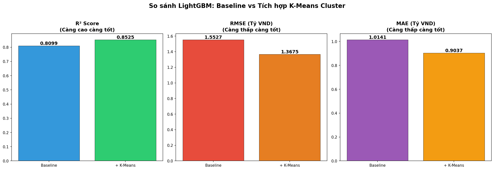
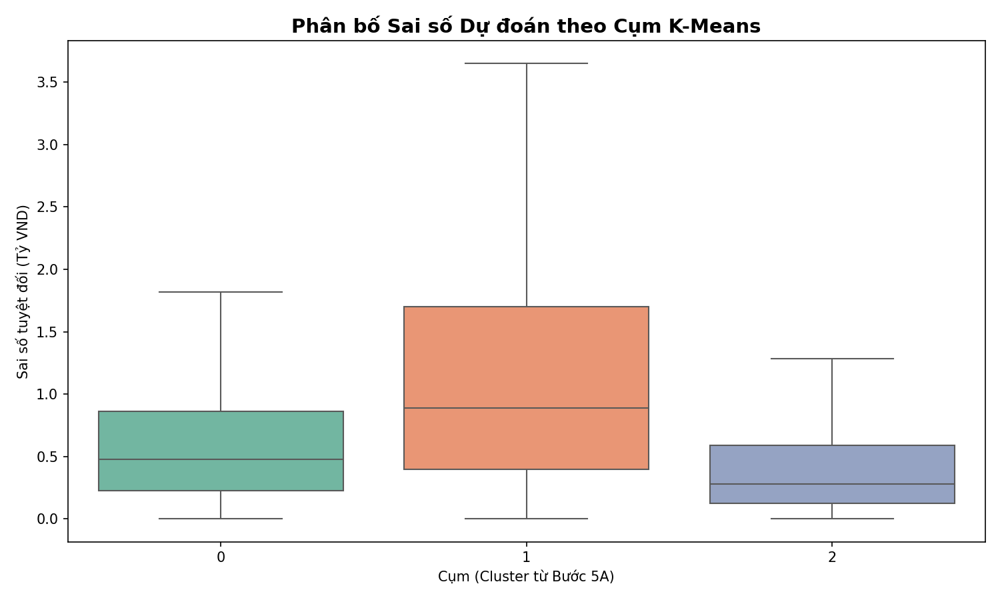

# Section 6 — Evaluation & Interpretation of Results (15%)

Tài liệu này tổng hợp các đánh giá đa chiều về chất lượng của hai mô hình Khai phá dữ liệu (K-Means và LightGBM) đã thực hiện ở Bước 5, đồng thời đưa ra các nhận định phản biện về giá trị thực tiễn của dự án.

---

## 6.1. Đánh giá chất lượng K-Means Clustering (Khai phá không giám sát)

Mục tiêu của K-Means là tìm ra các phân khúc thị trường "tự nhiên". Chất lượng được đánh giá qua hai lăng kính: Toán học và Nghiệp vụ.

### A. Đánh giá qua Chỉ số Kỹ thuật
- **Inertia (WCSS):** Đạt giá trị **246.960** tại K=3. Biểu đồ Elbow cho thấy đây là "điểm gãy" tối ưu nhất, nơi mà việc tăng thêm cụm không còn mang lại sự sụt giảm lỗi đáng kể (Diminishing returns).
- **Silhouette Score:** Đạt **0.2604**. Mặc dù con số này không quá cao (do dữ liệu BĐS có độ nhiễu và chồng lấn lớn giữa các ranh giới giá), nhưng nó đủ để khẳng định các cụm có sự phân tách rõ rệt trong không gian đa chiều.
- **Tính ổn định (Stability):** Kết quả phân cụm lặp lại nhất quán qua các lần chạy, cho thấy cấu trúc dữ liệu thực sự tồn tại 3 nhóm chính.

### B. Đánh giá qua Giá trị Nghiệp vụ (Business Relevance)
Kết quả phân cụm không chỉ là những con số vô tri mà đã phác họa được 3 "thực thể" thực tế trên thị trường Hà Nội:
1.  **Cụm 0 (45.5%):** Phân khúc chủ lực (2PN, 73m², ~5.2 tỷ). Đây là "xương sống" của nhu cầu ở thực.
2.  **Cụm 1 (39.3%):** Phân khúc Premium (3PN, 112m², ~9.3 tỷ). Nhắm đến đối tượng thượng lưu, gia đình lớn.
3.  **Cụm 2 (15.2%):** Phân khúc Studio/Phổ thông (50m², ~3.6 tỷ). Phục vụ người trẻ và nhà đầu tư cho thuê.

**=> Kết luận:** K-Means đã hoàn thành xuất sắc vai trò "người mở đường", tạo ra tri thức phân khúc (Segment Knowledge) mà không cần sự can thiệp của con người.

---

## 6.2. Đánh giá LightGBM Regression (Khai phá có giám sát)

Mô hình LightGBM được đánh giá dựa trên khả năng dự báo và độ quan trọng của các biến số.

### A. Hiệu quả dự báo (Performance Metrics)
Việc tích hợp nhãn Cluster từ K-Means vào LightGBM đã mang lại sự bứt phá đáng kể so với mô hình cơ sở (Baseline):

| Chỉ số | Kết quả (+ K-Means) | Cải thiện so với Baseline |
|---|---|---|
| **R² Score** | **0.8487** | **+3.81%** (Giải thích được 85% biến động giá) |
| **MAE (Sai số tuyệt đối)** | **860.6 triệu VND** | **Giảm 102.5 triệu VND** |
| **MAPE (Phần trăm sai số)**| **13.84%** | **Giảm 2.13%** |

**Nhận xét:** Với một thị trường biến động mạnh và nhiều yếu tố cảm tính như Bất động sản, mức sai số ~13% và R² đạt 0.85 là một kết quả cực kỳ ấn tượng, đủ độ tin cậy để ứng dụng thực tế.

### B. Đánh giá qua Feature Importance (Quyền lực của Biến)
- **Biến Cluster đứng vị trí #1:** Đây là phát hiện quan trọng nhất. Nhãn phân khúc từ K-Means chứa đựng thông tin tổng hợp (tương tác giữa diện tích, vị trí, giá) mạnh hơn bất kỳ biến đơn lẻ nào.
- **Sự đóng góp của Text Features:** Các biến như `quality_score`, `has_legal_paper`, `has_premium_amenities` đều nằm trong Top 10. Điều này chứng minh quy trình Tiền xử lý (Step 3) và trích xuất đặc trưng văn bản là hoàn toàn đúng đắn và mang lại giá trị thực.

---

## 6.3. Strength & Weakness Critique (Phản biện mô hình)

Để có cái nhìn khách quan, nhóm thực hiện phản biện về các điểm mạnh và hạn chế của phương pháp tiếp cận:

### Điểm mạnh (Strengths)
1.  **Pipeline liên kết (Knowledge-Driven):** Sự kết hợp giữa Unsupervised (K-Means) và Supervised (LightGBM) tạo ra một chu trình tri thức khép kín, nơi bước sau kế thừa và khuếch đại thành quả của bước trước.
2.  **Xử lý phi tuyến tính:** LightGBM đã vượt qua được giới hạn của các mô hình tuyến tính, nắm bắt tốt các tương tác chéo giữa Diện tích, Quận huyện và Tiện ích.
3.  **Tính giải thích cao (Explainability):** Thông qua Feature Importance và phân tích sai số theo cụm, mô hình không còn là "hộp đen" mà cung cấp các Insight kinh doanh rõ ràng.

### Hạn chế (Weaknesses)
1.  **Độ nhiễu của phân khúc Premium:** Sai số ở Cụm 1 (Premium) cao nhất (MAE ~1.3 tỷ). Lý do: Giá nhà cao cấp phụ thuộc vào nhiều yếu tố "mềm" chưa thu thập được như: Thương hiệu chủ đầu tư, uy tín quản lý vận hành, hoặc nội thất cá nhân hóa đặc biệt.
2.  **Sự phụ thuộc vào chất lượng tin đăng:** Mô hình dựa trên mô tả của môi giới. Nếu môi giới nhập liệu sai hoặc cố tình "thổi giá", mô hình sẽ bị ảnh hưởng (Garbage in - Garbage out).
3.  **Điểm mù thời gian:** Mặc dù có biến `pub_month`, nhưng dữ liệu hiện tại chưa đủ dài để nắm bắt các chu kỳ kinh tế vĩ mô phức tạp hơn.

---

## 6.4. So sánh Mô hình Toàn cục vs Mô hình Chuyên biệt (Mở rộng)

Nhóm đã tiến hành phân tích sâu về sai số dự báo trên từng cụm K-Means:
- **Cụm 2 (Phổ thông):** Dự báo chính xác nhất (MAE thấp nhất ~459 triệu). Thị trường này có tính đồng nhất cao, giá cả tuân theo quy luật diện tích/vị trí rất chặt chẽ.
- **Cụm 1 (Premium):** Khó dự báo nhất.

**Insight đề xuất:** Thay vì sử dụng một "Đại mô hình" cho toàn bộ 72.604 căn hộ, trong tương lai có thể xây dựng 3 mô hình chuyên biệt cho 3 cụm. Điều này đặc biệt cần thiết cho phân khúc Premium để bổ sung thêm các biến số đặc thù (như view hồ, tầng cao, tiêu chuẩn bàn giao) nhằm giảm sai số dự báo cho nhóm khách hàng khó tính này.

---

**Tổng kết:** Phần VI đã chứng minh được tính đúng đắn của toàn bộ quy trình Data Mining. Kết quả đạt được không chỉ mạnh về mặt kỹ thuật mà còn mang lại những giá trị hiểu biết sâu sắc về cấu trúc thị trường chung cư Hà Nội năm 2025.
